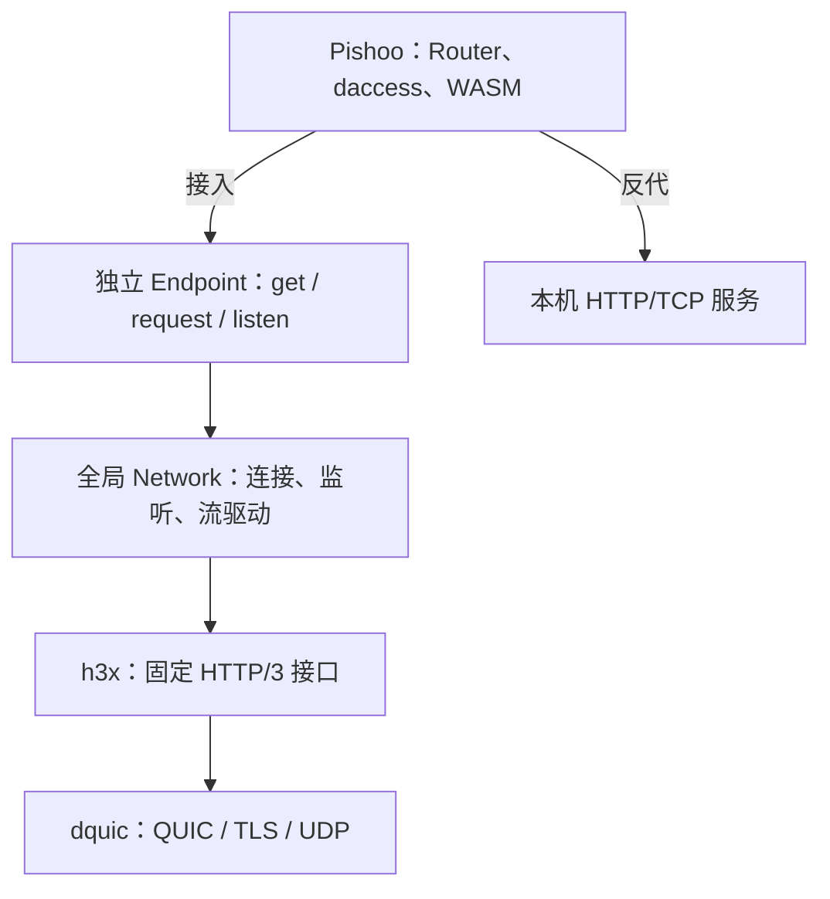

# h3x、dhttp、Pishoo：第一版架构

日期：2026-09-26。状态：冻结设计的架构说明；实现及验收进度见[实施记录](../IMPLEMENTATION.md)。全部结构成员以[清单入口](README.md)列出的接口文件为准。

## 1. 三个仓库的职责

| 仓库 | 职责 | 上层使用方式 |
| --- | --- | --- |
| h3x | HTTP/3 消息、QPACK、流式读写、协议错误与取消 | dhttp 调用既定连接与消息接口 |
| dhttp | 身份 Endpoint、全局网络、连接复用、应用接入和通信关闭 | Pishoo 交付 Service，通过 Endpoint 发请求 |
| Pishoo | 路由、静态文件、反代、daccess、WASM | 组合已有 Router、组件与宿主能力 |



Pishoo 不取得 QPACK、H3 连接或 QUIC 读写流。dhttp 不认识 Lib、OpenAPI、Wasmtime Store。配置反代连接本机 HTTP/TCP 服务；同名身份专用的 DHTTP 正向代理在固定 `/std/dhttp/` 前缀使用 Server 的 Endpoint；Lib 的 WASI HTTP 出站暂不实现。

## 2. h3x 接口保持不变

```rust
let (writer, reader) = connection.open_bi().await?;
let (writer, reader) = connection.accept_bi().await?;

reader.read_request().await?;
reader.read_response(request_method).await?;
writer.write_request(request).await?;
writer.write_response(response, request_method).await?;
```

h3x Request/Response 已有流式读写、trailers 和 stop/cancel。dhttp 封装建连、收发配对和并发驱动，不为上述操作新增协议状态或完成通知。

标准 Tower/Axum/WASI Service 使用 DATA/trailers frame，h3x 消息使用 AsyncRead/AsyncWrite。因此只有在标准 Service 接缝做现成 StreamBody/UnsyncBoxBody 转换；这没有增加 HTTP/3 能力，也不需要自定义 Body 结构。局部转换函数不作为一套公共接口冻结。

## 3. Endpoint 与 Network

Endpoint 只持规范化名称，通过 `Endpoint::load(name)` 独立构造，不通过 Network 工厂创建。Network 的 init 幂等并在进程内装配一次，同名句柄按本端、远端名称值复用连接。

```rust
let endpoint = Endpoint::load("alice").await?;
let uri: http::Uri = "https://bob~/profile".parse()?;
let response = endpoint.get(uri)
    .header(http::header::ACCEPT, http::HeaderValue::from_static("application/json"))
    .await?;
```

URL/header 在调用处解析；Request 只保存 Endpoint 和有效消息，不保存待报错字段。出站发送和响应读取并发推进，响应头可以先于上传完成返回。错误通过 Result、读写或任务结果直接传播。

Network 无初始化配置；init 准备全部可用网卡，netwatcher 的初始事件和后续事件触发同一扫描。每次 `Endpoint.listen` 直接向 qconn 交付该 Server 的监听范围。连接超时和单流窗口采用模块内部默认值；dhttp 不设置单次开流、消息头或 Body 读写超时，也不配置全局或逐 Endpoint 的连接、交换、总字节配额。

qconn 按名称限制来源，覆盖握手及已建立连接的新路径；其他名称的 External 不扩大 Internal 名称的准入。全部 socket 供出站共用，Scope/Scopes 复用 qconn 已有定义。

### 监听与进程生命周期

- Endpoint 不提供 close 或 stop_listening。同名句柄仍可出站。
- Pishoo Server 关闭时清空 Router 并清空当前 Lib；它不持有或停止监听任务。
- Network 属于进程生命周期，不提供全局 shutdown。Pishoo 退出时等待应用任务；监听任务、连接池、已建立连接和网络维护任务留到进程退出。运行期间不删除身份，身份目录变化统一重启生效。
- 尚在建立的连接受其请求 future 和底层 qconn 契约约束；不能用文档宣称取消等待者必然立即停止底层建连任务。

Network 按名称值保存 h3x 复用池，Incoming 的本端名称必填、远端可选；Outgoing 的远端名称必填、本端可选，不能同时缺少两端身份。Eq/Hash 统一比较本端和远端名称，双方具名且名称相同时，入站、出站键匹配同一池条目。匿名入站不用于按远端名称发起的新请求。Network 的监听表只保存 Service，qconn 保存 TLS、scopes 和接入回调；取消监听时一并撤销名称和 Service，socket 保留。没有逐身份关闭记录、OwnerKey、阶段包装、配额或报告缓存；详见 [dhttp 清单](dhttp-interfaces.md)。

## 4. 可信身份直接复用 dquic

dhttp 在入站请求交付 Service 前展开 authority 简写，核对它与握手的本端身份，并交付已有 `HandshakeSummary`，其中包含 `local`、`remote` 和 ALPN。Pishoo 用对端已经验证的名称和证书完成授权。

- 摘要存在且 remote=None 才能按匿名处理；摘要缺失或握手失败不是匿名。
- `LocalAuthority` 的签名能力留在宿主，不能原样交给 guest。
- 不新建 RequestInfo、Peer、ClientIdentity 等同义模型。
- 网络来源范围由通信层准入；不虚构一个现有连接结果里没有的逐请求 ingress_scope。
- 转发出站时不继承入站宿主身份 extensions，认证身份由当前 Endpoint 决定。

## 5. daccess、Workspace 与 Chat

2026-10-02 用户确认以远端目标分支作为审批和联系人协议基准，并先 rebase 适配，暂缓底层接口对齐。daccess 固定 cf8f72f，Pishoo 功能基线为 feat/daccess@9b733c5；完整接口以 [Pishoo 清单](pishoo-interfaces.md) 和 [Workspace/Chat 清单](workspace-chat-interfaces.md) 为准。

每个 Server 拥有独立 AccessService、Workspace 和 Chat。可信身份仍来自 HandshakeSummary 的名称及证书 SKI owner_hash，不从普通 HTTP 头构造 Visitor。Allowed 进入业务，Denied 返回403，Reviewing 立即返回202及状态地址。审批记录由 daccess 持久管理，状态查询按 Visitor 的名称与 SubjectId 校验，获准后重试业务请求并消费决定。连接退出不删除审批。

联系人通过 Workspace 的本地持久队列发送稳定 application_id，接收方记录申请并从接收时起计算7天期限，申请方查询 /std/contact/self 得到状态和精确授权。批准操作只更新接收方本地状态；ContactNotifier 与 Syncing 回调移除。首次 POST /std/contact 仍由接收方访问策略决定。

Workspace 保留完整前端、资料设置、联系人目录和能力审批；Chat 只通过 POST /std/message 投递，消息历史来自本地 chat.db。Server 显式组装路由；本地管理操作核对 owner，公开资料仅放行精确 GET 路径，Chat 入站同时要求 daccess 允许和有效能力授予。

生产出站尚未绑定新 Endpoint；暂时保留分支现有 OutboundTransport 接口和可用的模拟实现测试。远端资料返回连接不可用，发送申请和聊天消息仍保存在各自队列中。实际连接的身份核对、证书更新与网络往返验收留待底层稳定后处理。

## 6. Pishoo 第一版配置

用户配置只保留每个 Server 的监听范围和代理路由。实例目录由 DHTTP_HOME 决定，没有实例配置文件或数据库。

第一版不设置 Server 级统一请求并发限额，静态和代理不经过通用应用租约；Lib 不限制并发数，保留单次执行约束。内存、fuel、I/O 期限和有界队列使用明确的内部默认值，不把每项实现参数都做成用户配置。保留必要的执行约束，不新增配置 v2、Lib 策略 JSON、策略交集或默认导入账本。具体字段见 [Pishoo 清单](pishoo-interfaces.md)。

```text
DHTTP_HOME/<name>/
  ssl/                         身份材料，仅宿主使用
  db/config.db                 settings(listen) + proxy_locations
  db/access.db                 daccess 权限与审批数据
  db/workspace.db              资料、联系人申请与能力决定
  db/chat.db                   消息、投递队列与远端授权观察
  file/                        静态文件
  lib/<LibId>/lib.wasm          组件和内嵌 OpenAPI
  db/<LibId>/             Lib 私有数据库与 SQLite 辅助文件
```

config.db 的 v1 settings 必须只有一行，listen 为 0=off、1=Internal、2=External、3=both；proxy_locations 保存 location 与 proxy_pass。listen 改变重启生效。run 不持有实例锁。

## 7. 直接装配 Server、Router 和 Sandbox

Server 直接持有当前 Router 和该身份的 Sandbox；Sandbox 集中持有 Lib 集合、共享 WasmRuntime 引用与任务跟踪器。`run` 以局部变量持有跨身份共享的 WasmRuntime，其内部只保留 Engine 和 Linker；组件仅在启动时串行加载，不增加 compile_slots、compile_tasks、编译取消对象。

按用户确认，组件扫描、manifest 验证、版本替换、API 路由与执行、Store、响应体及 WASI 宿主能力全部集中在 sandbox 逻辑模块，按职责分文件。Server 保留 Endpoint、daccess、Workspace、Chat、整体 Router。Sandbox 负责该身份的 WASM 执行和任务回收，不限制并发数，不另存内部锁、取消信号、计数、身份或策略，不是操作系统进程或容器；完整字段和方法以 [Pishoo 清单](pishoo-interfaces.md)为准。

启动时加载一次：读取配置 → Sandbox 扫描并串行编译 Lib → 构造 Lib Router 和完整 Router。加载失败直接结束启动，候选使用 Sandbox 方法中的局部 HashMap。身份、配置、Lib 和证书/私钥变化统一重启生效，不支持 SIGHUP 重载；运行期间维护 DNS/地址与业务 worker，并每72小时刷新已加载身份的 OCSP。没有 ServerState、Release、begin_build、发布编号或后台构建队列。

同步编译不会因为丢弃等待 future 就自动停止。第一版不承诺可强行中断编译；不为这项尚不需要的能力扩展运行时成员。

一个 WASM 文件就是一个 Lib；每次调用创建独立 Store/Instance。编译组件可以共享，权限上下文和可变 guest 内存不共享。Lib 不设置并发执行槽或 permit，隔离由实际 Store、WasiCtx、limiter/fuel 和宿主能力实现；guest 计算受 fuel 限制，WASI HTTP 出站由无状态 hook 明确拒绝。

### 调用关系

```text
Endpoint.listen
  → 标准 HTTP 请求 + HandshakeSummary
  → Pishoo 本端绑定检查
  → daccess 授权与审批结果
  → Router 的静态 / 本机代理 / DHTTP 正向代理 / Sandbox Lib API 分支
  → 标准响应
  → dhttp 调用 h3x writer
```

## 8. 流与任务各自收尾

Pishoo 跟踪 guest、宿主 I/O 和应用 producer；dhttp 持有自己的读写和连接任务。应用 EOF 与传输写完可能不同，各层按自己的操作结果释放资源，不设 finished/ExchangeControl。

Server 关闭时清空 Router、同步调用 Sandbox.close；Endpoint 监听登记持续到进程退出。Sandbox.close 关闭任务跟踪器并清空集合；它不等待，`wait` 沿用15秒上限。关闭的 TaskTracker 仍允许旧 Router 登记新执行；在途 guest 继续执行直到自身结束；等待超过15秒返回 ShutdownDeadline。Server 不批量取消 HTTP；审批记录由 daccess 持久保存。关闭还停止并等待 Workspace/Chat 的 worker，未完成投递保留在数据库供恢复。Sandbox 的任务跟踪器直接跟踪持有 Store 的 guest 任务；执行和传输资源沿用各自的所有权。

原 body 被替换或 HEAD/204/304 抑制时，旧 Body 直接丢弃，不另行取消 guest，也不影响最终合法响应。传输错误由读写操作返回；没有继续 I/O 的 guest 可能运行到自行结束。

WASM 产生响应头后可以继续读上传或写响应。响应使用 Wasmtime 原生 Body 的现成适配，guest 由 Sandbox 的 TaskTracker 跟踪；Body 不持有任务句柄，也不增加丢弃取消句柄或 XxxGuard 类型。

## 9. 本机反代与 DHTTP 正向代理，Lib 出站暂缓

代理负责路由和路径转换，用 HTTP/1.1 客户端连接回环 TCP 地址；配置支持带路径的 `http://127.0.0.1:8080` 和裸 `127.0.0.1:8080`。代理清理 HTTP/3 与 HTTP/1.1 之间的逐跳头，按上游 authority 设置 Host，不自动生成 `X-Forwarded-*`。

同名身份专用的 DHTTP 正向代理在 `/std/dhttp/{*path}` 接收请求，包括带或不带末尾斜杠的目标根路径及其子路径。Pishoo 核对已验证来访者与本 Server 的名称和 SKI owner_hash，按路径中的目标名称构造 DHTTP URI，使用本 Server 的 Endpoint 转发并流式交付响应；不会继承来访者的可信身份 extensions，也不使用配置反代或 Lib 出站 hook。

Lib 仍使用 WASI HTTP 接收请求并产生流式响应；宿主的无状态 hook 对 guest 发起的 HTTP 出站返回 HttpRequestDenied，不调用 Wasmtime 默认网络发送器。身份签名验证只读取本端或当前握手对端的已验证公钥。

## 10. 保留的路由和组件规则

- WASM 使用 `/std/api/<LibId>`；未声明路径404、方法不匹配405，业务 HEAD/OPTIONS 必须显式声明。系统路径不回退代理；旧 `/api/*` 由配置代理独立处理。
- 仅 `/std` 根路径及其路径段子路径为系统保留；daccess、Workspace/Chat、Pishoo 管理和 DHTTP 正向代理全部位于该命名空间。旧顶层路径释放给代理，无兼容别名或重定向。
- 静态文件只在 `/std/file/{*path}` 提供，URL `/std/file/a` 映射身份目录 `file/a`；根入口不提供文件。静态只接受 GET/HEAD，目录只尝试 index.html，不列目录。Workspace 保留自身页面深链接 fallback。
- 代理作为 fallback，先精确 `= /path`，再最长路径段前缀；query 不参与，`/foo` 不匹配 `/foobar`。`/std` 不回退代理，旧 `/file` 是普通代理路径；未命中代理配置返回 404。proxy_pass 无 URI 路径时保留原路径，有 URI 时替换命中部分，不自动补斜杠。保持已有尾斜杠重定向规则。
- 组件顶层恰有一个 `pishoo:openapi` 段，内容为有界 UTF-8 OpenAPI 3.1.x JSON；不运行 guest 获取 API 清单。
- 第一版仅字面量路径和显式方法；OpenAPI JSON 直接反序列化为 oas3 类型，不额外拒绝重复键或描述字段中的外部引用。路径级引用无法提供显式方法，仍拒绝路径级引用、未支持的路径模板和保留路径冲突。schema 用于描述，不因此缓冲整个请求。
- OpenAPI 描述路由，不自动写 daccess 规则；权限管理使用当前库的 API，管理界面按它适配。x-access 扩展不产生隐式授权或自动导入流程。
- 每 Lib 只取得 db/<LibId>，挂载为 /db；宿主授权、配置与聊天数据库、其他 Lib 目录、身份根、ssl 与组件目录不开放给 guest。目录或组件替换不能扩大旧请求已取得的能力。
- 组件及其 OpenAPI 使用同一文件快照，部署用临时文件加原子 rename。静态按每请求打开的文件句柄读取，不承诺整个静态目录的事务快照。
- 启动身份凭据验证失败记录身份名和原因并跳过，继续后续身份，下次启动重试；配置、数据库及 Lib 加载失败仍结束启动。运行期间不更新身份和 Lib，目录变化在重启后生效，数据目录保留。

## 11. 实施和验收顺序

1. dhttp 用既定 h3x 接口完成 Endpoint 收发、共享连接复用及标准 Service 接入；h3x 无接口改造。
2. Pishoo 直接装配 Router 和 Lib，接入当前 daccess 库，复用旧分支中兼容的身份、数据库和管理路由装配。
3. Lib 通过 Endpoint 收发，反代通过本机 HTTP/1.1 客户端收发；两者都不操作 QPACK/H3 流。

重点检查：上传与响应并发、trailers 多值、提前 Drop、body 替换、HEAD/204/304、guest 取消、同名 load 复用连接、不同本端身份不共池、daccess 允许/拒绝/审批结果、审批状态查询归属和一次性决定消费及管理界面对当前库 API 的适配。

设计约束与实现验收分别记录；内存流和本地执行验证不代表真实跨端联网已经完成。
