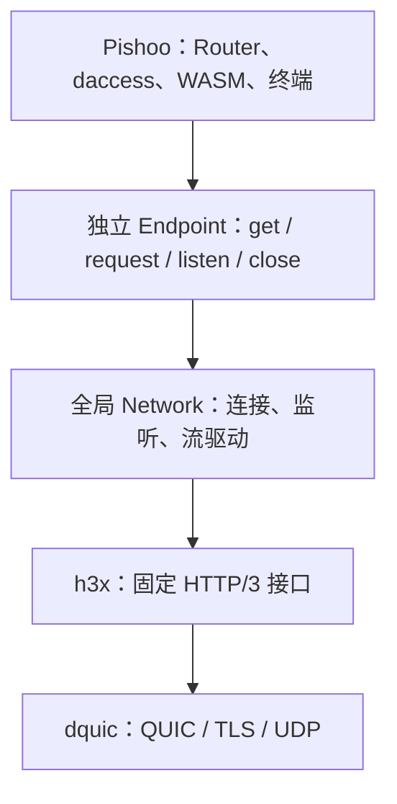

# h3x、dhttp、Pishoo：第一版架构

日期：2026-09-26。状态：冻结设计的架构说明；实现及验收进度见[实施记录](../IMPLEMENTATION.md)。全部结构成员以[清单入口](README.md)列出的三个文件为准。

## 1. 三个仓库的职责

| 仓库 | 职责 | 上层使用方式 |
| --- | --- | --- |
| h3x | HTTP/3 消息、QPACK、流式读写、协议错误与取消 | dhttp 调用既定连接与消息接口 |
| dhttp | 身份 Endpoint、全局网络、连接复用、应用接入和通信关闭 | Pishoo 交付 Service，通过 Endpoint 发请求 |
| Pishoo | 路由、静态文件、反代、daccess、WASM 和终端 | 组合已有 Router、组件与宿主能力 |



Pishoo 不取得 QPACK、H3 连接或 QUIC 读写流。dhttp 不认识 Lib、OpenAPI、Wasmtime Store 或终端进程。反代和Lib统一通过当前身份的dhttp Endpoint出站。

## 2. h3x 接口保持不变

```rust
let (writer, reader) = connection.open_bi().await?;
let (writer, reader) = connection.accept_bi().await?;

reader.read_request().await?;
reader.read_response(request_method).await?;
writer.write_request(request).await?;
writer.write_response(response, request_method).await?;
```

h3x Request/Response 已有流式读写、trailers 和 stop/cancel。dhttp 封装建连、收发配对和并发驱动，不为上述操作新增协议状态或完成通知。

标准 Tower/Axum/WASI Service 使用 DATA/trailers frame，h3x 消息使用 AsyncRead/AsyncWrite。因此只有在标准 Service 接缝做现成 StreamBody/UnsyncBoxBody 转换；这没有增加 HTTP/3 能力，也不需要自定义 Body 结构。局部转换函数不作为一套公共接口冻结。

## 3. Endpoint 与 Network

Endpoint 只持规范化名称，通过 `Endpoint::load(name)` 独立构造，不通过 Network 工厂创建。Network 全局初始化一次，同名句柄使用同一逻辑身份和连接资源。

```rust
let endpoint = Endpoint::load("alice").await?;
let uri: http::Uri = "https://bob~/profile".parse()?;
let response = endpoint.get(uri)
    .header(http::header::ACCEPT, http::HeaderValue::from_static("application/json"))
    .await?;
```

URL/header 在调用处解析；Request 只保存 Endpoint 和有效消息，不保存待报错字段。出站发送和响应读取并发推进，响应头可以先于上传完成返回。错误通过 Result、读写或任务结果直接传播。

NetworkConfig 第一版只配置监听规则。连接超时、操作超时和单流窗口采用模块内部默认值；不配置全局或逐 Endpoint 的连接、交换、总字节配额。

每个 Server 的允许来源与 Network 实际入口同时生效；共享网络不能让只允许 Internal 的身份因其他身份允许 External 而被放开。Scope/Scopes 复用 qconn 已有定义。

### 关闭选用第二种：立即关闭

```rust
endpoint.stop_listening()?; // 停止新入站，可再次 listen，仍可出站
endpoint.close()?;          // 立即取消该身份通信并关闭已建立连接
network.shutdown()?;       // 立即关闭全部身份和共享网络
```

- close 按名称作用于所有同名句柄，其他名称不受影响。
- 不等待优雅排空，不带 deadline，不生成 ShutdownReport 或累计关闭计数。
- 为保持第一版简单，close 后该名称在本进程中保持关闭；临时停服务使用 stop_listening，同名重新启用发生在进程重启后。
- 返回表示取消已发出、当前连接和登记已处理，不表示所有后台任务或远端操作已结束。
- 尚在建立的连接不能在关闭后重新接入；迟到结果须关闭并丢弃。底层 qconn 建连任务能否随等待者取消而立即停止，取决于其已有取消契约，不能用文档替代实现。

按身份拥有的连接记录只需要取消信号和活动连接集合。监听记录只保存实际应用、独立停止信号和底层登记句柄。没有 OwnerKey、阶段包装、配额或报告缓存；详见 [dhttp 清单](dhttp-interfaces.md)。

## 4. 可信身份直接复用 dquic

dhttp 向受信任宿主交付已有 `HandshakeSummary`，其中包含 `local`、`remote` 和 ALPN。Pishoo 核对本端名称及 authority 后，用对端已经验证的名称和证书完成授权。

- 摘要存在且 remote=None 才能按匿名处理；摘要缺失或握手失败不是匿名。
- `LocalAuthority` 的签名能力留在宿主，不能原样交给 guest。
- 不新建 RequestInfo、Peer、ClientIdentity 等同义模型。
- 网络来源范围由通信层准入；不虚构一个现有连接结果里没有的逐请求 ingress_scope。
- 转发出站时不继承入站宿主身份 extensions，认证身份由当前 Endpoint 决定。

## 5. daccess 以当前库接口为准

以当前 daccess 库的 `AccessService`、`AuthResult` 和 `management_router` 为依据，已核对核心接口所在提交为 `origin/main@1ec62d4`。尽量复用 [pishoo/feat/daccess](https://github.com/genmeta/pishoo/tree/feat/daccess) 的集成；不兼容处调整 Pishoo，不要求 daccess 恢复旧接口。

每个身份使用自己的 `db/access.db` 和一个 AccessService，同进程挂载。SubjectId 沿用证书 SKI 中 owner_hash 的文本字节。可信身份取自 HandshakeSummary，并转换为库已有的 SubjectId 和 Visitor。

Allowed 进入业务，Denied 返回 403；`Reviewing(id, state, registry)` 在当前请求中等待 `state.await`，按库返回的 `Result<Action, RequestResetError>` 继续或拒绝。请求退出时取消未完成的审批并删除 live 登记，局部清理复用现成库工具。Pishoo 不新增审批状态结构、后台等待任务或结束通知。

第一版填写 `Headers.request_id = None`，采用当前请求内审批。库已有绑定 RequestId 的持久审批能力，但本版不新增 RequestId 传输协议。旧分支的 202 响应和状态轮询不作为兼容要求。

管理路由直接使用 `access_control::management_router`，包括 `/contact`、`/contacts`、`/acl/*`，在根路径挂载并通过同一授权层。具体路径、请求体和响应体以库为准；保留 `/workspace` 和 `/workspace-api/context` 的装配方式，管理前端按当前 API 适配。不保留旧状态查询的 ACL 豁免，不新增默认规则导入器或跨库账本。

## 6. Pishoo 第一版配置

用户配置只保留：

- 实例的状态目录。
- 终端是否启用、管理员身份名单。
- 每个 Server 已有的监听范围和代理路由。

第一版不设置 Server 级统一请求并发限额，静态和代理不经过通用应用租约；Lib 执行和终端分别保留自己的限制。内存、fuel、I/O 期限和有界队列使用明确的内部默认值，不把每项实现参数都做成用户配置。保留必要的执行约束，不新增配置 v2、Lib 策略 JSON、策略交集或默认导入账本。具体字段见 [Pishoo 清单](pishoo-interfaces.md)。

```text
DHTTP_HOME/<name>/
  ssl/                         身份材料，仅宿主使用
  db/config.db                 settings + proxy_locations
  db/access.db                 原 daccess 权限数据
  file/                        静态文件
  lib/<LibId>/lib.wasm          组件和内嵌 OpenAPI
  lib/<LibId>/data/             Lib 私有数据
```

沿用现有 config.db schema：settings 必须只有一行，listen 为 0=off、1=Internal、2=External、3=both；proxy_locations 保存 location 与 proxy_pass。监听范围改变重启生效。实例锁由 run 持有，不再创建锁管理结构。

## 7. 直接装配 Server、Router 和 Lib

Server 直接持有当前 Router 及已加载的 Lib。组件加载和重载串行进行，Runtime 只保留 Engine 和 Linker；不增加 compile_slots、compile_tasks、编译取消对象。

按用户确认，每个 Server 另持有一个 Sandbox，接收原有的 Lib 执行 Semaphore 与任务跟踪器。Sandbox 负责该身份的4槽 WASM 准入和任务回收；身份取消、Endpoint、Router、Lib 集合与共享 Runtime 仍由 Server 持有。Sandbox 不另存取消信号、计数、身份或策略，不是操作系统进程或容器；具体字段和 `new/close/wait` 方法以 [Pishoo 清单](pishoo-interfaces.md)为准。

一次重载直接完成：读取配置/组件 → 校验并编译候选 → 构造 Router → 替换当前 Router。失败保留当前可用内容；在途请求持有自己已取得的 Router/Lib 引用。没有 ServerState、Release、begin_build、发布编号或后台构建队列。

同步编译不会因为丢弃等待 future 就自动停止。第一版不承诺可强行中断编译；不为这项尚不需要的能力扩展运行时成员。

一个 WASM 文件就是一个 Lib；每次调用创建独立 Store/Instance。编译组件可以共享，权限上下文和可变 guest 内存不共享。并发准入直接使用现成 Semaphore，隔离由实际 Store、WasiCtx、limiter/fuel 和宿主能力实现；执行取消必须能到达 guest 和宿主 I/O，不能只依赖外层 timeout。

### 调用关系

```text
Endpoint.listen
  → 标准 HTTP 请求 + HandshakeSummary
  → Pishoo 本端绑定检查
  → daccess 授权与审批结果
  → Router 的静态 / 代理 / WASM 分支
  → 标准响应
  → dhttp 调用 h3x writer
```

终端保留路径由 TerminalManager 执行额外的实例管理员准入。终端协议版本头在普通 guest 保留头清洗之前读取；它不参与身份认证，也不转给 guest。

## 8. 流与任务各自收尾

Pishoo 跟踪 guest、宿主 I/O 和应用 producer；dhttp 持有自己的读写和连接任务。应用 EOF 与传输写完可能不同，各层按自己的操作结果释放资源，不设 finished/ExchangeControl。

Server 关闭时先取消身份根 token，使 HTTP、审批、Lib 和终端同时收到取消，再同步关闭 Sandbox 执行准入和 Endpoint。Sandbox 的任务跟踪器只回收 WASM supervisor；`close` 不等待，`wait` 沿用15秒上限。每次调用仍通过 Invocation 把现成 permit 交给实际 Store，Store 回收时归还，Sandbox 不替代执行隔离或传输所有权。

原 body 被替换或 HEAD/204/304 抑制时，只结束旧 producer，不能让它取消最终合法响应。正常 EOF 后 Drop 不重复取消；超时和失败通过错误/取消表达，不伪装成正常 EOF。

WASM 产生响应头后可以继续读上传或写响应。Body 包装只负责应用任务与输出的关联，使用现成取消工具完成局部清理，不新增 XxxGuard 类型。

## 9. 出站统一使用 dhttp Endpoint

反代和 Lib 的所有出站请求都调用当前 Server 的 Endpoint：

```rust
let response = endpoint.from_request(request).await?;
```

代理负责路由、路径和 headers 转换；Lib 宿主负责出站授权。目标统一遵循 dhttp 的名称、URI 和身份验证规则，没有 UpstreamKind、传输选择字段或普通 HTTP 客户端。目标不受支持或连接失败时直接返回错误，不尝试其他传输。

这里仍复用标准 HTTP Request/Response、Body 和 WASI HTTP 类型；它们描述消息，不代表另有一套网络客户端。协议连接、认证与收发均由 dhttp 封装。

## 10. 保留的路由和组件规则

- `/api/<LibId>` 专供 WASM，包括 `/api/index`；未声明路径 404，方法不匹配 405，业务 HEAD/OPTIONS 必须显式声明。
- `/contact`、`/contacts`、`/contact/*`、`/acl/*` 为当前 daccess 管理路由保留，`/workspace`、`/workspace-api/context` 为管理前端保留；`/.pishoo/`、`/shell` 继续保留，不能由代理或 Lib 遮盖。
- 静态只接受 GET/HEAD，目录只尝试 index.html，不列目录。workspace 自身保留原管理前端的深链接 fallback，不能与普通静态站点规则混用。
- 代理先精确 `= /path`，再最长字符串前缀；query 不参与。proxy_pass 无 URI 路径时保留原路径，有 URI 时替换命中部分，不自动补斜杠。保持已有尾斜杠重定向规则。
- 组件顶层恰有一个 `pishoo:openapi` 段，内容为有界 UTF-8 OpenAPI 3.1.x JSON；不运行 guest 获取 API 清单。
- 第一版仅字面量路径和显式方法；拒绝重复键、外部引用、未支持的路径模板和保留路径冲突。schema 用于描述，不因此缓冲整个请求。
- OpenAPI 描述路由，不自动写 daccess 规则；权限管理使用当前库的 API，管理界面按它适配。x-access 扩展不产生隐式授权或自动导入流程。
- 每 Lib 默认只取得自己的 data；身份根、ssl、数据库和兄弟 Lib 不开放给 guest。目录或组件替换不能扩大旧请求已取得的能力。
- 组件及其 OpenAPI 使用同一文件快照，部署用临时文件加原子 rename。静态按每请求打开的文件句柄读取，不承诺整个静态目录的事务快照。
- 坏 Server 不影响其他身份；坏 Lib 首次启动跳过，更新失败保留旧 Lib。确认删除的 Lib 撤入口并取消对应执行；数据目录保留。

## 11. 终端也纳入本版

终端的两个配置字段、全部资源成员、固定线协议和平台后端见[终端清单](terminal-interfaces.md)。管理员名单为空不能启用；Server 自身身份不会自动获得终端权限。

一个 CONNECT 对应一个会话。先返回 200 确认 HTTP 隧道，再收 OPEN，进程准备成功后发 READY；输入结束是半关闭，输出及退出信息可以继续。

一个 TerminalSession 从准入开始持有启动、运行和清理资源，不另设 LaunchGuard。Linux 原生命令须处于独立 OS 隔离边界；macOS 第一版采用纯 WASI helper。平台探测或隔离验收不通过就拒绝该模式，不能回退到宿主 shell。当前均未实施或完成平台验收。

## 12. 实施和验收顺序

1. dhttp 用既定 h3x 接口完成 Endpoint 收发、标准 Service 接入及立即关闭；h3x 无接口改造。
2. Pishoo 直接装配 Router 和 Lib，接入当前 daccess 库，复用旧分支中兼容的身份、数据库和管理路由装配。
3. Lib 和反代统一通过 Endpoint 收发，移除直接 QPACK/H3 流参数。
4. 终端按已定协议和平台方案实现，单独完成隔离与资源回收验收。

重点检查：上传与响应并发、trailers 多值、提前 Drop、body 替换、HEAD/204/304、guest 取消、同名 close 影响全部句柄、其他身份不受影响、stop_listening 后可再监听、daccess 允许/拒绝/审批结果、审批等待取消后的清理及管理界面对当前库 API 的适配。

设计约束与实现验收分别记录；内存流和本地执行验证不代表真实跨端联网或终端平台隔离已经完成。
