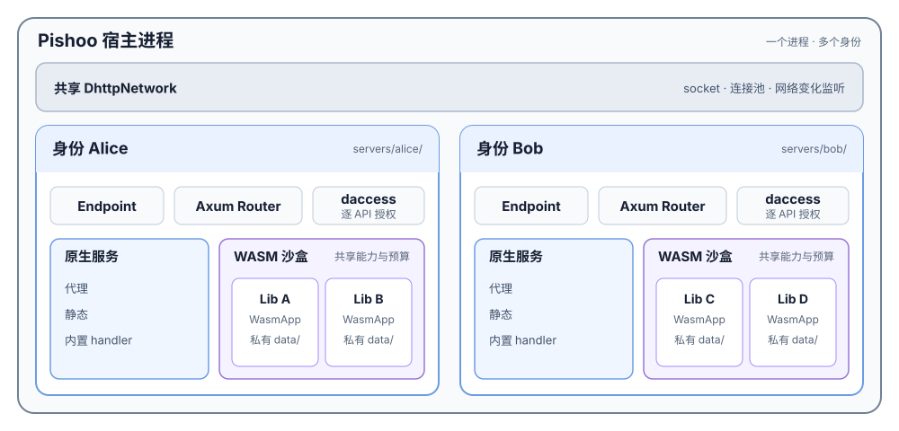
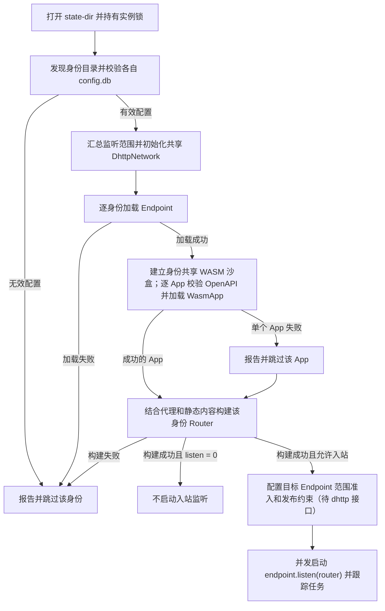

# Pishoo：数据库、Endpoint 与 Router 设计

日期：2026-09-22。状态：**设计约定，未开始实现。** 本轮依据 [dhttp 顶层接口稿](../../dhttp/docs/api/top-level-review.md) 调整，不以 dhttp 当前代码为依据。

函数签名见 [Pishoo 接口约定](pishoo-api.md)，上游对接见 [DHTTP 接入说明](dhttp-integration-contract.md)，应用约束见 [身份沙盒与 OpenAPI](wasm-sandbox-design.md)。

## 1. 主体设计

Pishoo 在一个宿主进程内共享 `DhttpNetwork`。每个有效身份拥有自己的 Endpoint、Router、daccess 和 WASM 沙盒；Router 组合代理、静态、内置 handler 与该身份的多个 `dhttp::WasmApp`。



图中 Alice 和 Bob 示意两个身份；每个身份各有一个 WASM 沙盒，原生服务与该沙盒平级。每个 App 独立加载为 `dhttp::WasmApp`，并有私有 `data/`。`config.db` 提供监听范围和代理规则，`ssl/` 提供 Endpoint 凭据，`db/access.db` 提供逐 API 授权，`public/` 和各 App 目录提供路由内容。

启动装配顺序如下。单个 App 失败只跳过该 App；配置或 Endpoint 无效才跳过整个身份。



一个非 root 宿主进程运行所有身份。直接复用 dhttp 的 Endpoint、全局 Network 和标准 Service，用 Axum 组装 Router。Pishoo 只承担配置读取、目录发现、路由与固定应用策略，不在这些对象外增加另一套运行时框架。

首版保持这些决定：

- 移除旧 server/worker 子进程及其 IPC；受限终端另用独立 OS 沙盒子进程，保留 PTY/管道能力。
- 按全新安装设计，不读取旧配置或提供双运行模式。
- 每个 Server 的 config.db 保存监听范围和反向代理 location，实例根目录不设 pishoo.db；每身份 daccess 使用独立的 db/access.db；每个 WASM 文件配套标准 OpenAPI 文档，声明 API，可选提供默认权限建议；身份沙盒能力及资源上限由宿主控制。
- 每个规范化身份名称对应一个服务目录、一个 Endpoint 和一份当前 Router；不做别名或名称转移。
- WASI HTTP p2 由 dhttp::WasmApp 加载和执行；Pishoo 为每个身份建立一个共享沙盒，所有 `.wasm` 共享该身份的能力上限和资源账户，各自独享持久数据目录。
- 首次启动时，单个 App 校验或加载失败只跳过该 App 并报告；该身份的其他 App、静态和代理服务仍可启动。
- 普通更新先准备新 Router，成功后替换；身份删除优先于内容更新。
- 远程终端以 Pishoo 运行账号的 home 为工作空间，但在独立 OS 沙盒中运行 WASM Shell 和原生 CLI；首版采用 HTTP/3 Extended CONNECT，一个请求对应一个终端，等待 dhttp 的双向流接缝接入。权限边界见 [受限远程终端设计](ssh-wasm-terminal.md)。

不做指定系统账号登录、普通 WASM App 常驻后台任务、任意 native plugin、浏览器 JS 环境或跨机器配置集群。受限终端使用独立的 WASM Shell，不属于 `/api/<AppId>` 的普通 HTTP App。正向代理、relay 和长期会话等既有能力按对应 dhttp 接口另行接入，不让 Pishoo 重新装配底层 QUIC/网络运行层。

## 2. 固定目录与身份发现

```text
<state-dir>/
  servers/
    <server-name>/
      config.db                # 当前 Server 的设置及代理规则
      ssl/
        <server-name>.pem
        <server-name>.key
      db/access.db             # 宿主 daccess 管理，不挂给 guest
      public/
      apps/
        profile/
          app.wasm
          openapi.json
          data/
        notes/
          app.wasm
          openapi.json
          data/
```

目录名必须是规范化 DHTTP 名称，并与证书名称一致；不以证书的其他 SAN 自动创建别名。只扫描 servers 的直接子目录，不扫描系统账号、用户组或用户 home。身份材料无效的目录不启动服务，错误不影响其他身份。

身份从目录发现；该身份 config.db 中的代理表为空时，仍可提供静态或 WASM 服务。每个库只属于所在 Server，代理行不携带 server_name，也不再需要全局孤立身份代理行的 prune 操作。

`--state-dir` 是唯一定位参数，默认使用当前账号的应用状态目录。实例 `init` 创建状态目录；`server init NAME` 为已有合法身份目录显式初始化 config.db 和默认设置，不生成身份凭据；`run` 要求已初始化，并持有唯一 daemon 实例锁。schema 版本使用 SQLite user_version，不另外建版本表。不读取 pishoo.conf、server.conf、mime.types 或业务环境变量；每个 `apps/<AppId>/` 包含固定名称的 `app.wasm`、`openapi.json` 和私有 `data/`，不再要求 component 导出私有 manifest。

身份路径如何接入 dhttp 轻量凭据读取，按其设计稿留在接入细节；不改变 Endpoint.load(name) 的公开形状，不复制到用户 home。拥有 state-dir 写权限的账号等同于整个实例管理员。

## 3. 数据库配置

每个 `servers/<server-name>/config.db` 保存两张表：一行 Server 设置和该 Server 的代理路由。daccess 继续单独使用 `db/access.db`，本次不合并权限库的 schema/migration。

```sql
CREATE TABLE settings (
    listen INTEGER NOT NULL DEFAULT 1 CHECK (listen BETWEEN 0 AND 3)
);
INSERT INTO settings (listen) VALUES (1);

CREATE TABLE proxy_locations (
    location   TEXT PRIMARY KEY NOT NULL,
    proxy_pass TEXT NOT NULL
) WITHOUT ROWID;
```

settings 只保存一行、一个 listen 整数，以位标记表示范围：

| listen | 含义 |
| --- | --- |
| 0 | off，不接收入站服务 |
| 1 | Internal |
| 2 | External |
| 3 | Internal + External |

这是 Pishoo 的持久化编码，接入 dhttp 时显式转换为其 Scopes，不依赖上游枚举的数值。初始化写入一行，默认 1。首版不加辅助 id；数据库值约束限制范围，读取时额外校验整数类型且恰好一行，空表或多行都属于无效配置。CLI 在事务内校验单行后执行 UPDATE settings SET listen = ?，不会用 INSERT 追加设置。CLI 中的 NAME 用于定位数据库，不保存到每条代理规则里。

location 采用精简 Nginx 语法，由 CLI 写入 config.db，运行时构建匹配表。支持普通前缀和 `=` 精确匹配，具体规则见下节。config.db 保存当前 Server 的运行配置，身份来自目录和凭据，ACL 由 daccess 保存。

使用 SQLite WAL、短事务、有限 busy timeout；settings 和 proxy_locations 在该库的一致读事务中校验。daemon 定期读取各身份配置，代理变化重建该身份 Router。监听范围首版修改后重启生效；运行中的有效范围保持原值并报告待重启，不能让一次代理刷新顺便放宽监听范围。

config.db 缺失或首次校验失败只阻止对应身份启动，不临时生成更宽松的配置；运行时读取失败保留该身份最后有效配置。实例锁或全局网络初始化失败才终止整个实例。备份按 Server 包含 config.db、daccess 数据、身份材料、App 部署文件及 data。

### 3.1 逐 Server 监听范围与共享网络

Network 可以共享 socket，实际绑定范围按各已批准 Server 配置的并集生成；每个目标 Server 仍必须独立执行范围准入。例如 Alice 仅 Internal、Bob 仅 External，启用 External socket 不得使 Alice 也从 External 可达。

当前 dhttp 顶层稿仅有全局 Network scopes，Endpoint.listen 不接收范围。要实现此设计，需要补充按目标 Endpoint 的可信入站范围检查及服务发布约束；不能只靠来源 IP、Host header 或 Router 里的业务 ACL 模拟完整网络范围隔离。具体签名尚待上游对齐，在此接缝完成前不支持混合范围配置的上线，不能静默扩大范围。每 Server 均关闭入站时不调用其 listen；需要的主动出站网络能力另按网络契约提供。

### 3.2 精简 Nginx location

数据库保持 `proxy_locations(location, proxy_pass)` 两列。location 存规范化表达式，例如 `/backend/` 或 `= /health`；两者作为不同主键，可同时配置同一路径的前缀和精确规则。写入时解析并统一 `=` 后的空格，保留路径尾斜杠；CLI put/remove 使用相同规范化规则。每行等价于一个仅含 proxy_pass 的平级 location 块。

| location 值 | 匹配行为 |
| --- | --- |
| `= /health` | 仅精确匹配 `/health` |
| `/backend/` | 字符串前缀匹配 `/backend/`、`/backend/users` |
| `/backend` | 字符串前缀匹配 `/backend`、`/backend/users`、`/backendx` |
| `/` | 代理范围内的兜底前缀 |

匹配顺序是精确优先，否则选择最长字符串前缀，与数据库行顺序无关。query 不参与匹配，所有 HTTP 方法使用同一 location；daccess 仍独立按实际 method/path 授权，其路径段匹配不能与代理字符串前缀算法混用。

路径使用统一规范化结果，始终区分大小写，拒绝穿越及歧义编码；此处沿用 Pishoo 的严格校验，不承诺 Nginx 所有平台和 URI 容错行为。保留管理路径先分派。代理之间允许前缀覆盖，按上述优先级决定；与已发布 WASM API/静态路径的覆盖仍拒绝新 Router，包括 `/` 代理遮盖已有业务的情况。

首版接受普通前缀和 `=`；`^~`、`~`、`~*`、`@name`、变量、嵌套 location、rewrite/if/try_files 及任意指令块直接报配置错误。已有 gateway 支持更多语法，数据库入口仍按这个子集校验。使用 Nginx 风格匹配和路径替换，不提供完整 Nginx 配置兼容。

### 3.3 proxy_pass 与命令行对应

proxy_pass 为固定 http/https 上游 URL，可含端口和 URI 路径；首版拒绝变量、userinfo、fragment、上游 URL 自带 query、命名 upstream 组及 Unix socket。保留“未写 URI 路径”和“显式写 `/`”的区别，解析 URL 时不能把两者归一成相同值。

- 无 URI 路径，例如 `http://127.0.0.1:8080`：保留已通过校验的原始请求 path/query。
- 带 URI 路径，例如 `http://127.0.0.1:8080/` 或 `/v1/`：用该路径替换规范化请求中匹配 location 的部分，再附上原 query。精确匹配替换整个路径。
- 路径按替换结果直接拼接，不自动补斜杠。例如 `/backend/` → 上游 `/v1`，请求 `/backend/users` 的结果为 `/v1users`；应写 `/v1/` 得到 `/v1/users`。

| location | proxy_pass | 请求 | 上游路径 |
| --- | --- | --- | --- |
| `/backend/` | `http://127.0.0.1:8080` | `/backend/users?page=1` | `/backend/users?page=1` |
| `/backend/` | `http://127.0.0.1:8080/` | `/backend/users?page=1` | `/users?page=1` |
| `/backend/` | `http://127.0.0.1:8080/v1/` | `/backend/users` | `/v1/users` |
| `= /health` | `http://127.0.0.1:8080/status` | `/health` | `/status` |

沿用 gateway 的尾斜杠补全：存在 `/backend/` 代理时，`/backend` 请求在无更优精确匹配时返回 301 到 `/backend/`，保留 query；`= /backend` 可显式处理该请求。自动补全仅针对对应代理前缀，不作为通用 rewrite 功能；发布冲突检查也需计入此入口。

对应的 Nginx 风格表达：

```nginx
location /backend/ {
    proxy_pass http://127.0.0.1:8080/;
}
location = /health {
    proxy_pass http://127.0.0.1:8080/status;
}
```

通过命令行保存到 `servers/alice/config.db`（命令为设计接口）：

```sh
pishoo proxy put alice /backend/ http://127.0.0.1:8080/
pishoo proxy put alice '= /health' http://127.0.0.1:8080/status
pishoo proxy list alice
pishoo proxy remove alice '= /health'
```

验收需覆盖精确优先、最长前缀、`/backend` 匹配 `/backendx`、query 保留、URI 路径缺省/显式斜杠、301 与精确覆盖，以及不支持语法拒绝且旧 Router 不变。依据：[Nginx location](https://nginx.org/en/docs/http/ngx_http_core_module.html#location)、[Nginx proxy_pass](https://nginx.org/en/docs/http/ngx_http_proxy_module.html#proxy_pass)。

## 4. 初始化和监听

实现保持在少量装配函数内，签名见 [接口约定](pishoo-api.md#2-pishoo-只需要的装配函数)：

1. 打开 state-dir、持有实例锁，发现身份目录。
2. 逐身份读取 config.db，校验设置和代理规则；坏身份跳过并报告。
3. 根据有效身份的监听需求初始化共享 Network，并准备逐身份范围准入。
4. 为各有效身份加载 Endpoint，将该身份的代理行、public 和 apps 交给 build_router。
5. 按该身份有效监听范围并发启动服务，保存任务并处理更新/关闭。

所有身份共享 Network 的 socket、网络变化监听、STUN 与连接池。范围规则由 Network 持续跟踪网卡变化；逐身份准入为待补接口，不虚构 Endpoint.listen 的新签名。应用内容更新不重新初始化 Network，停止某个 Endpoint 不 shutdown 全局网络。

## 5. Router 与请求约束

路由顺序固定为：保留管理路径 → 代理精确/最长前缀匹配 → OpenAPI 声明的 WASM App API → 静态文件 → 404。Router 外层执行 Server 身份检查、总资源约束、日志和取消；所有 WASM 分支进入当前身份的共享沙盒，按 App 配置宿主能力。

### 5.1 目录映射

| 内容 | 路由 |
| --- | --- |
| `public/index.html` | `/` |
| `public/assets/app.js` | `/assets/app.js` |
| `apps/chat/app.wasm` OpenAPI: `GET /rooms` | `GET /api/chat/rooms` |
| `apps/orders/app.wasm` OpenAPI: `POST /` | `POST /api/orders/` |
| `apps/index/app.wasm` OpenAPI: `GET /health` | `GET /api/index/health` |

`apps/` 直接子目录名决定 AppId，WASM 统一挂载到 `/api/<AppId>`，配套 OpenAPI 决定该 App 下的名称、方法和应用内路径。Pishoo 按 API 清单逐条注册，不把整个前缀交给 guest。guest 收到剥离一次挂载前缀的应用内路径，query 保留。静态只处理 GET/HEAD，命中文件但方法不支持返回 405；目录只尝试 index.html，不列目录，不自动做 SPA fallback。

保留 `/.pishoo/`、`/shell` 和 `/shell/`；数据库行或 App API 占用它们时拒绝候选。WASM API、代理和静态路径相互覆盖时拒绝有冲突的新 Router。`index` 与其他 App 一样挂载到 `/api/index`，只发布 OpenAPI 中列出的 API。`/api` 与 `/api/` 命名空间专供 WASM API；静态和代理不得占用或覆盖，代理 location `/` 等覆盖该范围的配置也拒绝。未声明的 `/api/...` 路径返回 404，不回退到静态或代理。路径使用同一套规范化规则，拒绝穿越、歧义编码、重复路由及跨平台大小写碰撞。

### 5.2 身份与权限

Server 代表一个人。所有 App API 的调用者授权由 Pishoo 在进入 WASM 前完成，App 不承担调用者鉴权；App 的执行能力也由宿主限制，不能超出身份沙盒的已批准能力。

Router 在构建时绑定 Endpoint 名称。请求身份直接来自 dhttp 的 HandshakeSummary/ArcConnection extensions，authority 必须匹配当前身份，不能用它选择其他 Router。握手失败或缺失可信元数据不能视作匿名成功。

Server 外层校验可信身份事实、本端身份与 authority；WASM API 匹配 method/path 后由每身份 daccess 根据可信名称、SubjectId、方法及规范化实际路径授权。普通 OpenAPI 不要求权限扩展；App 可选用 `x-access` 声明 daccess 风格的 allow/review/deny 主体列表，部署时接受并导入为初始规则，不覆盖管理员配置，后续更新不自动重新导入。缺省沿用 daccess 基础策略，缺失扩展不拒绝加载。静态与代理保留自身访问默认，管理路径专门授权；daccess 管理接口的路径挂载需避开保留路径冲突并保持自身受保护，不在本轮冻结。默认规则导入、来源跟踪和路由发布协调尚待实现，不能在 daccess Denied 后用 App 默认另行放行。guest 身份 header 仅是 ABI 投影。见 [逐 API 授权](wasm-sandbox-design.md#3-逐-api-访问策略)。

首版由前端直接调用 daccess 管理权限，以真实访问主体鉴权。WASM 不提供修改 ACL 的能力；宿主同时阻止 guest 通过出站、自调用或联系人管理间接改变授权。付款等业务结果触发的自动授权不在首版范围，后续按具体需求设计可信流程。

静态、代理、内置原生 handler 和 WASM 都受 Server 执行边界的身份、总预算与请求生命周期约束。该身份的所有 `.wasm` 共享一个身份沙盒；原生分支不属于 WASM 沙盒。原生代码仍与 daemon 共享进程权限，不能把 middleware 当作 native 内存或 OS 隔离。

## 6. WASM App

Pishoo 从已验证的内容快照向 `dhttp::WasmApp` 提供 component 字节。一个 `.wasm` 是一个包含多个业务 API 的 App。沙盒单位是规范化 `server_name`，Pishoo 不为每个 App 创建 Endpoint；宿主在身份沙盒内按 App 隔离文件能力。

每个 component 配套一份标准 OpenAPI 3.1.x JSON 文档，可由 utoipa、aide 等普通工具生成，不要求 Pishoo 宏、SDK、operationId 或自定义扩展。宿主静态解析 method/path 注册入口，默认权限建议和访问规则扩展可选，执行能力不由 OpenAPI 声明，guest 继续使用标准 WASI HTTP method/path 分发。宿主记录文档与组件摘要，若文档带可选组件摘要则验证；不带摘要时由部署工具保证成对提交，原子发布协议尚待实现。完整约定见 [身份沙盒与 OpenAPI](wasm-sandbox-design.md)。

所有 App 共享该身份的并发、内存/CPU/handle/log/outgoing 总账户；各自的 `/data` 只映射 `apps/<AppId>/data/`，不开放包含代码和文档的 App 根目录；`public` 如获准只读提供，`tmp` 按 invocation 创建。每请求创建独立 Store/Instance/ResourceTable，代码缓存可共享，不共享可变 guest 内存。App 的目录读写等能力限制在每次请求环境中实施，不创建额外 App 沙盒。

仅服务自身身份的入站调用可以进一步使用当前 Endpoint 出站，并且必须符合身份沙盒 outgoing allowlist 和宿主的 App 能力及调用者限制。guest 无法指定其他源身份。反向代理行不授予 WASM 通用网络权限。

返回响应头后，guest、上传、响应 body 和子请求可能仍在工作；资源需保留到实际完成并回收。headers 前失败可返回 500/504，headers 后通过 body error 结束当前流。dhttp 宿主注入、完整流式出站和终态通知尚待接入稿补具体签名，不用新的 Pishoo 类型掩盖这些留白。

## 7. 扫描和更新

扫描器监听 `public/`、`apps/` 直接子目录的发现/移除及各 App 的 `app.wasm`、`openapi.json`，并定期校验漏事件。校验代码与文档配对；`apps/<AppId>/data/` 不递归扫描、不触发路由重建，代码更新保留 data，身份材料单独处理。忽略临时/隐藏文件；拒绝 symlink、hard link、特殊文件及跨目录访问，按稳定目录句柄验证实际对象。

静态内容、组件及 OpenAPI 来自验证后的不可变快照，不让旧 Router 在源文件覆盖后读到新字节。快照有文件数、字节数和缓存上限。扫描期间内容不稳定则重试或保留旧 Router；去抖不保证多个文件属于同一次逻辑部署。批量 deploy 的磁盘提交协议另定，不在首版接口里承诺。

| 变化 | 行为 |
| --- | --- |
| 当前 Server 代理表变化 | 校验该身份配置，重建受影响 Router；未变的 WASM 复用 |
| public 或 App 部署文件更新 | 为变化 App 准备匹配的组件与 OpenAPI 快照，复用身份沙盒账户，校验完整 Router 后替换；未变化 App 可复用 |
| 单个 App 的 OpenAPI、组件、权限/资源检查或文件读取失败 | 报告并跳过该 App 的候选版本；已有版本保持服务，首次加载失败则不发布该 App，不影响同身份其他路由 |
| 完整 Router 存在路由冲突或无法构建 | 保留当前 Router，报告原因 |
| 删除单个 App 的 wasm/OpenAPI 配对 | 新 Router 停止该 App 准入，取消该 App 执行，不影响同 Server 其他 App |
| 新身份目录 | 身份和首次 Router 准备成功后启动监听 |
| 删除身份目录 | 先关准入，再停监听并取消该身份任务、关闭 Endpoint |
| 身份材料替换 | 首次实现重启加载新材料，不承诺热轮换 |
| 当前凭据失效或撤销 | 停止该身份，取消请求和会话 |
| 监听设置变化 | 标记该身份待重启，保持运行中有效范围 |
| daemon 重启 | 从各 Server config.db 和目录重新构建，不恢复历史发布记录 |

每个身份整体替换自己的 Router，不承诺跨身份同一时刻切换。可用 ArcSwap 和标准 Service 闭包装配热更新；身份沙盒账户跨 Router 更新共享，不因文件更新重置。当前请求持有旧 Router、组件和请求能力快照直到结束。

构建提交前确认输入未过时、身份未删除且 Endpoint 生命周期未更换；删除与提交串行处理，过时构建不能复活旧身份。同一身份的构建合并或串行执行；长编译不阻塞配置轮询、删除或退出。同一 App 的旧新版本可能同时访问该 App data，应用负责并发写入及数据兼容；不同 App 及不同身份的 data 始终隔离。

## 8. SSH 与关闭

首版远程终端采用 HTTP/3 Extended CONNECT，入口 `/shell`，一个 CONNECT 请求对应一个 shell/PTY。多个终端通过独立请求复用同一个 H3 连接，每个请求分别授权、计额和管理生命周期。不依赖 WebTransport，也不额外实现 DShell 的会话内多 channel 复用。

Extended CONNECT 是协议建立机制，不等于 WebTransport；首版在该请求流的 DATA 帧中承载终端消息，不要求 h3x 适配 WebTransport 的会话、多流路由或数据报能力。终端协议需明确版本协商、消息类型、长度和大小上限，覆盖启动参数与结果、stdin、终端输出、窗口大小调整、输入结束、退出码、错误及关闭语义，并实现有界缓冲、背压和取消。具体 `:protocol` 标识和线格式在客户端与服务端接入时一起确定；不得将当前 DShell over WebTransport 客户端或标准 SSH 客户端视为可直接兼容。

只允许已验证且被实例配置显式授予终端权限的 DHTTP 身份；Server 的自身身份不自动获得终端。URL 不选择系统账号。首版不启用 PAM/password 或 forwarding，拒绝 root 终端。

终端的 `home` 是启动 Pishoo 的系统账号 home。Pishoo 主进程保留 Endpoint 和私钥；终端子进程运行受限的 WASM Shell，原生 CLI 只能在相同 OS 沙盒中执行。终端可读写非保留的 home 内容，Pishoo 整个 state-dir 和其他指定敏感目录不可见；不把真实 home 直接预打开为 WASI `/home`。此终端的准入是实例级管理员授权，但终端执行能力小于不受限的宿主 shell。具体权限、OS 沙盒和验收见 [受限远程终端设计](ssh-wasm-terminal.md)。

dhttp 本轮未冻结 Extended CONNECT 双向流接缝；接入前，身份和权限校验通过的 shell 请求返回 501，不启动终端。接入后由主进程管理会话流和终端子进程，删除旧 `pishoo-ssh-session` helper 与本地 remoc/FD 桥接。单个终端关闭只结束对应请求流并清理其进程，不关闭共享 QUIC 连接，也不影响其他终端。缺少经验证的 OS 沙盒时，不开放原生 CLI，不退回同账号的非受限 shell。

断连、身份失效、目录删除、超时和退出都触发幂等清理：停止受影响终端的消息处理，取消 I/O，HUP/TERM/KILL 进程组并 wait/reap；身份失效、目录删除和 daemon 退出同时停止对应范围的新终端准入。观测关闭后目标 5 秒内完成普通会话清理，网络中断的发现时延另由协议决定。普通内容更新不关会话；不承诺追踪主动脱离会话的所有后代。

正常 daemon 退出使用同一个绝对 deadline：停止准入和新构建 → stop_listening → 有界排空请求/会话 → close 各 Endpoint → 等待本地任务 → shutdown 全局 Network。达到 deadline 取消剩余工作并报告；目录删除和凭据撤销直接取消该身份活动执行。Drop 不负责启动无人跟踪的异步清理。

## 9. 模块与实施

模块按现有 crate 职责整理，不为每个动作先建立类型：

```text
pishoo/
  main / run       数据库读取、身份发现、Network/Endpoint/Router 装配、更新和退出
  proxy            单表查询、写入和 CLI
  discovery        固定目录扫描、校验和内容快照
  wasm             OpenAPI 校验、身份沙盒策略与多个 dhttp WasmApp 装配
  ssh              终端授权、隔离子进程及会话清理
gateway/
  reverse          Router、中间件、静态和代理 handler
```

删除旧 worker、用户组/home 扫描、配置 DSL 及 DShell SSH helper；移除仅为它们存在的 IPC 和直接底层协议依赖。新受限终端需要独立的沙盒子进程，不复用旧 `pishoo-ssh-session` 的 PAM/系统用户登录路径。发行包发布 pishoo 与受限终端运行所需组件，同步更新 README、systemd/Homebrew 和安装脚本；不自动删除操作系统已有账号或用户组。

实施先打通“读库 + 一个静态/代理 Router + 一个 Endpoint + 全局 Network”，再加入多个身份、目录更新和一个最小 WasmApp/OpenAPI 配对，随后实现同身份多 WASM 共享沙盒与跨身份隔离，最后接入 Extended CONNECT 终端。原生 CLI 还需完成跨子进程的 OS 隔离验收。不把身份热轮换或通用发布框架作为第一条请求的前置。

验收覆盖：纯静态身份没有代理行也可运行；多身份共享网络且独立关闭；同 Server 多 App 独享各自 data、共享资源总额、不同 Server 沙盒隔离；未声明 API 不进入 guest；OpenAPI 越权或配对错误只拒绝该 App 候选，首次启动仍发布同身份其他服务，更新时保留该 App 旧版本；Router 级失败保留旧 Router；删除单 App 不影响其他 App；请求中断后 body、guest 和子请求释放；代理表事务失败无半行；Linux/macOS 发行包不再启动旧 worker/DShell helper，受限终端仅在平台 OS 沙盒验收通过后开启原生 CLI。涉及 WASM/SSH 的用例在相应 dhttp 接缝完成后执行，本轮没有运行实现测试。
