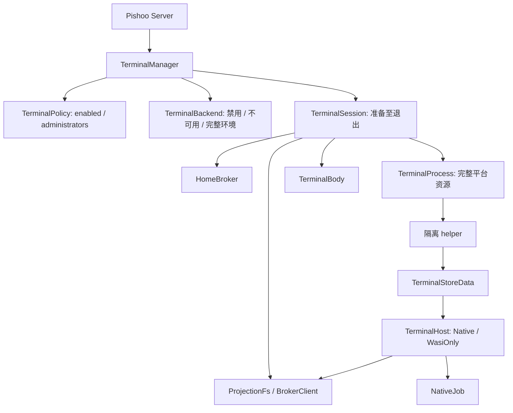

# 终端第一版结构、协议与平台边界

本清单遵循[设计准则和接口约束](README.md)，是待实现接口契约。Linux 和 macOS 的隔离路线已经选定，当前没有完成实现与平台验收，不能据此宣称终端已经受保护或可上线。默认关闭；配置打开后仍须通过平台探测和反例测试，失败返回 501，不回退为宿主 shell。

本模块只有一项用户配置 TerminalPolicy；其余类型持有实际运行资源或表达固定消息。完整名单为 TerminalPolicy、OsBackend、TerminalBackend、TerminalManager、TerminalSession、TerminalProcess、TerminalInput、Frame、HomeBroker、BrokerNode、BrokerClient、ProjectionFs、BrokerError、BrokerOp、BrokerAttr、BrokerDirEntry、BrokerValue、TerminalStoreData、TerminalHost、NativeJob、HelperCommand、HelperEvent、TerminalBody。WIT 生成类型以第 11 节固定协议为准，不手写同义模型。

只有 TerminalPolicy 是用户配置，其余类型是运行资源或固定协议消息。字段按下文声明；不把安装路径、平台探测结果、限额或期限重新包装成另一套配置对象。Serialize/Deserialize 只用于 TerminalPolicy 与消息，拒绝未知字段；OsBackend 不接受配置反序列化。

### 1. 归属和外部接缝

`TerminalManager` 属于 daemon，由所有 Server 共享；各 Router 持有 `Arc<TerminalManager>`。`TerminalPolicy` 是实例配置，不放进某个 Server 的 db/config.db。终端管理员必须出现在实例名单；某 Server 的 owner 不自动成为终端管理员。

每个会话只属于一次 Server 生命周期和一个可信远端身份。Server 将自己的 `CancellationToken` 传入；删除/撤权时取消该 token。名称相同的新 Server 使用新 token，旧清理不会影响新会话。停止监听但正常排空时不提前取消这个 token。

```rust
impl TerminalManager {
    pub fn new(policy: TerminalPolicy, state_dir: &Path) -> Result<Self, Error>;
    pub async fn handle(
        self: &Arc<Self>,
        server_name: &str,
        server_cancel: CancellationToken,
        request: http::Request<dhttp::Body>,
    ) -> Result<http::Response<Body>, Error>;
    pub fn revoke(&self, identity: &str);
    pub async fn shutdown(&self, deadline: std::time::Instant) -> Result<(), Error>;
}
```

`new` 只接受两个用户设置：开关与管理员名单。默认 enabled=false、名单为空。enabled=true 但名单为空或名称无效是配置错误；关闭时不打开 home，也不要求安装终端组件。启用后用 OS 账号库和发行布局探测环境，当前账号必须为非 root；环境未通过时保留不可用结果并记录原因，其他网关功能可继续运行，终端请求返回 501。不通过环境变量选择账号、home 或后端。`handle` 重新核对可信 HandshakeSummary 的 local 与绑定 Server 一致、remote 存在且为管理员，执行 CONNECT/version/来源和额度检查，构造本次 TerminalSession。禁用时返回 404，不暴露管理员名单；环境不可用但请求已通过身份检查时返回 501。权限失败为 403，authority 错误 421，方法错误 405，版本错误 400，资源满 429，关闭中 503，后端未通过验收 501。HTTP 准入失败不返回 200；200 只确认隧道接受，shell 启动结果由后续 READY 或 ERROR/EXIT 表达。会话完成前，Body 与 manager 的受跟踪任务共同持有必要资源；返回响应头不释放会话名额。

`revoke` 规范化名称，永久移除当前 manager 的该管理员准入并取消其已有会话；恢复权限通过重新加载实例配置和新 manager，不提供隐式恢复。`shutdown` 幂等：对现有 permits 调用 close 停止准入，取消 sessions 中的会话 token，再等待清理；所有阶段共用传入的绝对 deadline，超时返回明确错误，不能报告已回收。之后不接受新会话。

### 2. 最少结构及全部成员

以下是 crate 内部结构，除上述对接方法外不建立插件或公共 session 框架。使用 `std`、Tokio、tokio-util、Bytes 和 Wasmtime 现成类型。`u64` session id 仅供当前进程追踪，不是权限凭据，不支持重连复用。

```rust
pub struct TerminalPolicy {
    pub enabled: bool,
    pub administrators: HashSet<Arc<str>>, // 规范化 DHTTP 名称；不是 guest header
}

// 当前程序探测得到的内部结果，不是后端插件或用户可选配置。
enum OsBackend {
    Linux { install_dir: PathBuf, cgroup_root: PathBuf },
    MacOsWasi { install_dir: PathBuf },
}

// 可用性与它所必需的资源不可分开出现。
enum TerminalBackend {
    Disabled,
    Unavailable(Error),
    Ready {
        backend: OsBackend,
        run_user: Arc<str>,
        home_root: Arc<File>,
        protected_paths: Arc<[PathBuf]>,
        runtime_dir: PathBuf,            // state_dir/runtime/terminal
    },
}

pub(crate) struct TerminalManager {
    backend: TerminalBackend,
    administrators: Mutex<HashSet<Arc<str>>>,
    permits: Arc<tokio::sync::Semaphore>,
    sessions: Mutex<HashMap<u64, (Arc<str>, CancellationToken)>>,
    next_id: AtomicU64,
    tasks: tokio_util::task::TaskTracker,
}

struct TerminalSession {
    id: u64,
    caller: Arc<str>,
    server_name: Arc<str>,
    cancel: CancellationToken,
    permit: tokio::sync::OwnedSemaphorePermit,
    process: Option<TerminalProcess>,    // 启动函数成功返回完整资源后才设置
    input: TerminalInput,
    output: tokio::sync::mpsc::Sender<Result<Bytes, Error>>,
    started_at: std::time::Instant,
    last_activity: std::time::Instant,
}

// 每个分支只携带该平台必需且已取得的资源，不允许混合组合。
enum TerminalProcess {
    Linux {
        child: tokio::process::Child,
        pty: tokio::io::unix::AsyncFd<File>,
        control: tokio::net::UnixStream,
        mounts: [fuser::BackgroundSession; 2], // home/tmp 两个投影都必须存在
        cgroup: PathBuf,
        private_tmp: tempfile::TempDir,
        broker_task: JoinHandle<Result<(), Error>>,
    },
    MacOsWasi {
        child: tokio::process::Child,     // 构造时验证标准 Child 的三个 piped 句柄齐全
        control: tokio::net::UnixStream,
        private_tmp: tempfile::TempDir,
        broker_task: JoinHandle<Result<(), Error>>,
    },
}

// 阶段与仍可读取的实际 Body 放在一起，不能同时处在两个阶段。
enum TerminalInput {
    Data(dhttp::Body),                  // 可接受 Input 与控制帧
    Controls(dhttp::Body),              // 已收 InputEnd，只允许 Resize/Signal/Cancel
    Ended,                             // HTTP EOF 或终态错误后不再持有 Body
}
```

`TerminalSession` 在准入和名额预留后创建，process=None；等待 OPEN 不持有未完成的进程组合。启动函数只返回完整 TerminalProcess，成功后存入 process 并发送 READY。进入清理时取走整个 process，由消费它的 cleanup 调用继续拥有全部资源直到回收完成。process=None 不附带“正在运行”的其他进程字段，也不代表会话已完成；完成以 run 的返回为准。

TerminalBackend::Disabled 不打开 home、不要求组件安装；Unavailable 只保存探测错误；只有 Ready 能提供实际账号、home、后端和运行目录。new 完成同步账号与发行布局解析后一次构造相应分支，不边填一组 Option 边对外可见。Ready 表示完整环境资源已取得；实际发起前的 probe/资源申请仍可直接返回错误，不为这些调用再保存一份错误标志。enabled 是用户配置输入，随后直接决定 enum 分支，不再重复保存在 manager 中。

Session.cancel 是传入 server_cancel 的 child_token，父 Server 取消会直接传播；Body Drop、管理员撤权或 manager.shutdown 只取消该 child，不反向取消 Server。Manager 不另存 closing 或取消广播：permits.is_closed 是永久停止准入的事实，sessions 已保存逐会话的主动取消入口。准入获得 permit 后，依次持有管理员名单和 sessions 两把短锁，重查 semaphore 未关闭、管理员仍有效，完成登记并提交受跟踪任务；期间不 await。revoke 使用相同锁顺序；shutdown 只持 sessions 锁，关闭 semaphore 并取消已登记 token，防止关闭后迟到登记。禁止先持 sessions 再申请管理员锁。

Ready 中的 protected_paths 由第 9 节固定来源生成。文件 broker 只接受已经取得的目录句柄，不从客户端请求重新解释宿主路径。

#### v1 内部常量

这些值由 terminal 模块直接使用，不出现在 TOML/数据库，不新增 Limits/Options 配置结构。后续确有调整需求时再单独讨论哪一个值成为产品配置。

| 常量 | 固定值与用途 |
| --- | --- |
| MAX_SESSIONS | 4，实例级同时存在的会话 |
| LINUX_MEMORY_BYTES | 512 MiB，每会话 cgroup 内存总上限 |
| LINUX_CPU_QUOTA | 每 100000 µs 周期最多 100000 µs CPU；一个核的总额度 |
| LINUX_MAX_PROCESSES | 32；macOS 纯 WASI helper 只有一个 OS 进程 |
| MAX_FDS | 每 helper 256 个；文件 broker 另有自己的有界句柄表 |
| MAX_WASM_MEMORY_BYTES | 64 MiB，单个终端 Store 的线性内存总额 |
| WASM_FUEL_PER_SECOND | 1000 万；一秒内耗尽按资源超额终止，不等待自动恢复 |
| MAX_DISK_WRITE_BYTES | 每会话累计写入 home/tmp 最多 1 GiB |
| MAX_OPEN_FILES | broker/WASI 文件句柄最多 128 |
| HANDSHAKE_TIMEOUT | 10 秒，OPEN 与子进程准备共用 |
| IDLE_TIMEOUT | 15 分钟 |
| SESSION_TIMEOUT | 8 小时 |
| CLEANUP_TIMEOUT | 普通清理 5 秒；全局退出取与传入绝对 deadline 的较早者 |

macOS App Sandbox 不提供 cgroup 等效的整进程 CPU/内存硬配额。macOS v1 只承诺 WASM memory/fuel、明确有界的 host buffer/file 账户与会话期限；不允许通过配置宣称提供不存在的内核能力。Linux 只有实际启用表中的 cgroup 限制后才能发送 READY。

方法固定为：

```rust
impl OsBackend {
    fn detect(executable: &Path) -> Result<Self, Error>;
    async fn probe(&self) -> Result<(), Error>;
}
impl TerminalBackend {
    async fn spawn(
        &self,
        id: u64,
        open: &Frame,
        cancel: CancellationToken,
        deadline: Instant,              // started_at + HANDSHAKE_TIMEOUT，不重置建立期限
    ) -> Result<TerminalProcess, Error>;
}
impl TerminalProcess {
    async fn cleanup(self, deadline: Instant) -> Result<(), Error>;
}
impl TerminalInput {
    async fn read_next(&mut self, buffer: &mut BytesMut)
        -> Result<Option<Frame>, Error>;
}
impl TerminalSession {
    async fn run(self, manager: Arc<TerminalManager>) -> Result<(), Error>;
    async fn resize(&mut self, rows: u16, cols: u16) -> Result<(), Error>;
    async fn signal(&mut self, signal: u8) -> Result<(), Error>;
    async fn finish_input(&mut self) -> Result<(), Error>;
}
```

`spawn` 的 open 必须为已校验 `Frame::Open`，只在内部调用；没有可供业务代码随意启动进程的入口。成功启动后的 cleanup 消费完整 TerminalProcess，按平台分支取出资源并依次回收；启动失败由 spawn 在返回 Err 前回收自己的局部资源。实际完成后由 run 使用 manager 移除 sessions 项；run 返回时才归还 permit。会话 task 不能被外层直接 abort 跳过这些步骤。若进程卡在内核不可中断状态，保留资源记录和失败状态并持续回收，不把超时视作成功。

### 3. HTTP 建立与固定线协议

- 规范入口为 `CONNECT /shell`；保留兼容路径 `/shell/<run_user>`，仅允许精确匹配当前固定 run_user，不能选择其他系统账号。
- 使用 Extended CONNECT 的 `:protocol = pishoo-terminal`。该值通过 dhttp 既有 protocol 扩展表达，Pishoo 不拼 QPACK pseudo-header。
- 请求头 `pishoo-terminal-version: 1` 必须恰好出现一次；成功响应为 200，并回显同名头值 1。不接受逗号列表或未知版本，不自动降级。认证与路由先于读取 OPEN。
- 完成身份/版本检查、后端 probe 和名额预留后创建 TerminalSession，并把 session.run 登记到 manager.tasks，然后返回 200；客户端收到 2xx 才发送 OPEN。同一个 run 读取并校验 OPEN、准备隔离子进程，成功发送 READY 后才允许 INPUT。OPEN/进程准备共同受 HANDSHAKE_TIMEOUT 限制。建立失败发送 ERROR+EXIT 并清理；不能先等隧道 DATA 再发 200，从而与 CONNECT 客户端互相等待。
- 此版本仅为交互终端，PTY 模式合并 stdout/stderr，不额外提供非交互 exec 模式、多个 channel、任意环境变量、登录账号、agent forwarding 或端口转发。

所有整数采用网络字节序。帧为 `type:u8 + payload_len:u32 + payload`；最大 payload 16 KiB，头未完整可等待，长度超限立即失败。DATA payload 是任意 bytes，不做 UTF-8 解码；控制字符串为合法 UTF-8。未知类型、错误方向、重复 OPEN、输入结束后继续 DATA 均为协议错误。没有可跳过的扩展位或保留字段。

```rust
pub(crate) enum Frame {
    Open { rows: u16, cols: u16, term: String, cwd: String }, // 0x01 C→S
    Input(Bytes),                                         // 0x02 C→S
    Resize { rows: u16, cols: u16 },                        // 0x03 C→S
    InputEnd,                                             // 0x04 C→S
    Signal(u8),                                           // 0x05 C→S: 1=INT, 2=TERM, 3=HUP
    Cancel,                                               // 0x06 C→S
    Ready { session_id: u64, mode: u8 },                    // 0x10 S→C: 0=WASI, 1=Linux native
    Output(Bytes),                                        // 0x11 S→C, merged terminal output
    Exit { kind: u8, value: u32 },                         // 0x12 S→C
    Error { code: u16, message: String },                  // 0x13 S→C
}
impl Frame {
    fn encode(&self, output: &mut BytesMut) -> Result<(), Error>;
    fn decode(input: &mut BytesMut) -> Result<Option<Self>, Error>;
}
```

OPEN payload 顺序：rows:u16、cols:u16、term_len:u8、term bytes、cwd_len:u16、cwd bytes。rows/cols 范围 1..=1000；TERM 仅 `xterm-256color`、`xterm`、`vt100`、`dumb`，最多 32 bytes；cwd 为相对受控 `/home` 的路径，最多 1024 bytes，空字符串表示根；拒绝 NUL、绝对路径、`..`、编码歧义和保留目录。OPEN 最大 1063 bytes。首次 cwd 不存在或不可访问发送 ERROR(protocol)+EXIT(host/protocol)，不替换为任意其他位置。

RESIZE 恰为 4 bytes；SIGNAL 恰为 1 byte；INPUT_END/CANCEL payload 必须为零。READY 恰为 9 bytes，session id 没有恢复会话语义。EXIT 恰为 5 bytes：kind 0=正常退出，value 为 0..=255；kind 1=平台信号终止，value 为实际 signal number；kind 2=宿主终止，value 1=取消、2=空闲超时、3=总时长超限、4=资源超额、5=执行失败、6=输入协议错误。ERROR payload 为 code:u16 + message bytes，message 最多 1024 bytes；code 1=protocol、2=execution、3=resource、4=cancelled。公开消息不带私钥、宿主路径、环境或内部堆栈。

正常结束顺序为所有 OUTPUT → 一个 EXIT → response EOF；ERROR 可以出现一次，其后仍须发送一个 EXIT 并 EOF。若网络已取消无法发 EXIT，客户端视为传输失败，不能推断退出码 0。只有资源实际回收后会话计数才减少。取消时先尽快发起进程回收，不能为了写 EXIT 无限等待网络。

### 4. 半关闭、背压与错误

TerminalInput.read_next 把本次解析结果直接返回：Data 收到 InputEnd 时变为 Controls，并返回该命令；Controls 仍保有 Body，可继续读取 Resize/Signal/Cancel，收到 Input 或重复 InputEnd 返回协议错误。读取正常 HTTP EOF 时变为 Ended，取走并释放 Body 后返回 None；读取或解码失败同样取走 Body，直接返回 Err，不在旁边保留一个“仍正常”的 Body。Ended 再读只返回 None，不提供另一套 EOF/错误通知 future。OPEN 只由 run 的建立步骤接受，运行循环拒绝重复 OPEN。

READY 之后，INPUT_END 或请求 body 正常 EOF 都只关闭输入方向；两者可连续出现；run 通过幂等的 finish_input 主动关闭 helper stdin，正常 EOF 不取消输出。INPUT_END 重复视为协议错误。OPEN 尚未完整时 EOF 是建立失败。输出继续直到程序退出、明确取消或期限到达。响应 body 被提前丢弃、网络 reset、父 Server 取消，或 manager 对本会话发出主动取消命令，都会触发整个会话清理。

PTY 本身没有通用的写侧 EOF。INPUT_END 让 WASM shell 的输入适配器返回 EOF；对于已启动的原生前台作业，不伪造 Ctrl-D、不偷偷发送 TERM。原生程序是否结束取决于它的终端模式和正常行为，仍等待时由空闲/总时长期限收尾。客户端发送 Ctrl-D 字节属于普通 INPUT，由实际 termios 解释；它与 INPUT_END 不等价。RESIZE/明确信号可在 INPUT_END 后继续发送，直到请求 body EOF；输入 EOF 不剥夺进程发送退出信息的机会。

每个方向最多排队 16 个 DATA/OUTPUT frame（每帧 16 KiB，即 256 KiB），控制帧使用同一有界序列，不允许无限抢占队列。输出通道关闭立刻通知 session cancel；发送 Future 在取消与数据写入之间 select，避免慢网络阻止清理。parser、broker、WASI memory、PTY/管道和文件句柄另外纳入内存/handle 预算。空闲计时由成功转交的输入、有效控制消息或实际消费的输出更新；重复无效数据不延长会话，最长总时长不可续期。

建立前的错误返回普通 HTTP 状态；200 后只用 ERROR/EXIT、body error 或流取消，不尝试第二个 HTTP response。终端不得关闭共享 Endpoint/连接。普通 WASM HTTP 的 30 秒 deadline 不覆盖整个终端；使用本节建立、空闲、会话总期限。

### 5. home、文件和签名边界

真实 home 仅由宿主 broker 持有，子进程没有真实 home、state-dir、Endpoint、私钥、签名服务、daccess 数据库或管理 IPC 的句柄。受控 `/home` 是允许内容的投影，不是直接 preopen `$HOME` 再口头排除子目录。

broker 以目录句柄解析路径；每次 lookup/open/readdir/create/rename/remove 均检查规范化组件和保留对象。拒绝 symlink、hard link、特殊文件、Unix socket、跨挂载和 `..`；普通文件多链接计数大于 1 时拒绝。create/link/rename 不得制造对保留对象的别名，也不能替换保留目录或其祖先。目录遍历同样隐藏保留条目；返回的 handle 不暴露宿主 FD。打开后的资源仍按会话取消、FD 与累计写入额度管理。宿主并发替换无法安全判定时本次操作失败，不降为路径字符串前缀检查。

Linux 原生 CLI 的 `/home` 来自这个 broker 的 FUSE 投影；macOS 纯 WASI 文件操作经相同 broker 协议。broker 请求只从本会话继承的 socketpair 到达，单消息上限 64 KiB，每会话串行一个在途操作，不配置请求序号；只提供文件语义，不提供任意宿主 syscall、网络连接、进程启动或签名。

`/tmp` 会话私有，结束后清理。工具、动态库、必要系统数据只读；用户可写 home 不能替换固定 `shell.wasm`、helper 或启动文件。环境从空集合构造，仅 `HOME=/home`、`PATH=/tools/bin`、已验证 TERM、`LANG=C.UTF-8`、`TMPDIR=/tmp`；不继承宿主 token、代理变量、DYLD/LD 注入变量或 FD。v1 终端没有通用出站网络权限，也不继承 Server 的 DHTTP 出站身份；需要网络工具时应单独增加可审查的授权网络契约。

### 6. Linux 固定后端

选择非 root 的 user/mount/PID/IPC/UTS/network namespaces、独立根挂载视图、seccomp、`no_new_privs` 与 cgroup v2。不使用旧 PAM/SSH helper，不允许 root 登录或宿主 sudo。probe 必须验证 user namespace、挂载隔离、FUSE、delegated cgroup CPU/memory/pids 控制器与 cgroup.kill 可用；任何缺失令 native 模式不可用。

固定启动顺序：

1. 父进程先创建会话 cgroup，写入 memory.max、memory.swap.max=0、pids.max、cpu.max；helper 以受控启动握手进入 cgroup 后才执行 guest。daemon 本身不进入此 cgroup。
2. launcher 建新 namespaces、private mount propagation 和新根；仅挂只读 `/tools` 与受控 `/home`、私有 `/tmp`、私有 devpts 及最少设备。若需 `/proc`，只挂该 PID namespace 的 proc；不见宿主 `/proc`。
3. parent 保留 PTY master，helper 独立 session 持有 slave 和 controlling terminal。slave 成为 helper 的 0/1/2，其他继承 FD 仅control socketpair 与必要受控目录。用 `close_range`/明确 FD 白名单关闭其余句柄。
4. 完成挂载后丢弃 capabilities，启用 no_new_privs、seccomp；禁止 mount/unshare/setns、ptrace/process_vm、BPF/perf、module/reboot、keyring 和无关设备 ioctl；只开放终端和正常 CLI 所需的调用。禁止 socket 创建/网络，套接字能力仅继承的本会话 IPC。
5. helper 从固定组件运行 WASM shell；shell 的受控 process import 只能在这个 helper 内启动 argv 数组指定的程序。原生命令继承 namespaces、seccomp、cgroup、环境和投影视图。绝不让 daemon 直接执行 guest 给出的命令。

PTY 前台进程组由 helper 管理；RESIZE 对本会话 PTY 执行窗口调整，INT/TERM/HUP 只发送给本会话前台 job group。shell 可建立 pipeline/job，但不能指定任意宿主 pid。退出时先 HUP/TERM、在 清理 deadline 前 KILL；最后使用 cgroup.kill 回收包括 setsid/double-fork 的后代，并等待 helper 与 cgroup.events populated=0。进程组只是交互语义，不能取代 cgroup 后代回收。

cgroup v2 提供层级资源控制和递归 kill；这是选用它而非仅依赖 process group 的依据。[Linux cgroup v2 文档](https://kernel.org/doc/html/v6.7/admin-guide/cgroup-v2.html)。Landlock 可后续作额外防护，本版不把它当成隐藏目录/元数据或受控 home 投影的替代；其文件限制存在版本和已打开 FD 边界。[Linux Landlock 文档](https://cdn.kernel.org/doc/html/latest/userspace-api/landlock.html)。

### 7. macOS 固定后端

v1 选择**经过签名验证的 App Sandbox helper + 纯 WASI 命令模式**，不支持任意宿主原生 CLI。不是运行 `sandbox-exec` 的临时 profile，也不默认为 Linux 命令已有 macOS 等效隔离。

helper 必须启用 `com.apple.security.app-sandbox`，不授予 network、home/user-selected files、application-groups、自动化、调试或临时例外权限；只有固定安装资源、每会话私有工作目录和两个继承 IPC 通道。真实 home 操作经父端 broker；不申请整个 home 的 security-scoped bookmark。若 Wasmtime 当前编译器需要 JIT entitlement，发布时只加入经过验证的 `com.apple.security.cs.allow-jit`，不加入 unsigned-executable-memory 或 disable-library-validation 作为宽松兜底；签名/执行模式未验证即 probe 失败。

helper 连接固定 process import，但 macOS 实现统一返回 Unsupported；不注册真正的原生执行能力，只运行固定 shell.wasm 的 WASI 内建命令。每会话一个 helper/Store，fuel、memory limiter、FD/文件额度与会话期限在 helper 中执行；父进程保留独立的杀进程和 wait 路径。无子进程，因此不依赖 process group 去证明所有后代已回收。macOS 未通过 sandbox/FD/WASI 反例验收时终端整体关闭，返回 501。

Apple 的 App Sandbox 能力由每个 target 的签名 entitlement 决定；网络、用户选择文件和子进程继承都是独立能力，不能假设一个 CLI 自动取得正确边界。[Apple App Sandbox entitlement 文档](https://developer.apple.com/library/archive/documentation/Miscellaneous/Reference/EntitlementKeyReference/Chapters/EnablingAppSandbox.html)。本节的 macOS 路线是设计选择，尚未以当前打包方式验证。

### 8. 必须通过的验收

- 管理员正确授权；同名 Server 重建不会被旧取消误伤；一个终端结束不影响同连接其他请求。
- OPEN 分片、超长、重复、未知帧、错误方向、非法 cwd/TERM、版本不符；所有失败没有遗留子进程。
- stdout/stderr 合并、resize、前台 INT、stdin EOF 后继续输出 exit、断线取消、慢消费者不增加无界缓存。
- 经直接路径、`..`、符号链接、hard link、替换/重命名、备用挂载、继承 FD、`/proc/*/fd`、Unix socket 访问 state-dir/私钥/管理接口全部失败。
- guest 与 Linux exec 执行相同文件操作时看到同一投影视图；写配额、memory、CPU、进程数和 FD 额度都实际生效。
- Linux double-fork、setsid、后台 pipeline 后断线，cgroup 最终为空；helper 无法移出 cgroup或进入宿主 namespace。
- macOS helper 签名/entitlement 不符时拒绝；没有 host env/网络/原生 exec；纯 WASI CPU 死循环可以被回收。
- 首版不支持的原生/网络能力返回清晰错误，不在运行时改用宿主进程权限执行。

### 9. 程序确定安装、账号和保护路径

用户不配置 install_dir、helper、shell.wasm、工具目录、backend、run_user 或 home。程序用 `std::env::current_exe()` 取得实际可执行文件并 canonicalize；v1 发行布局固定为 `<prefix>/bin/pishoo`，所以 prefix 必须由这个实际位置精确导出。只验证以下相对位置，不搜索 PATH、当前目录、home 或兄弟源码仓库，不接受开发构建目录“猜一个组件位置”：

| 平台 | 固定发行文件 |
| --- | --- |
| Linux | `<prefix>/bin/pishoo-terminal`；`<prefix>/share/pishoo/shell.wasm`；只读工具根 `<prefix>/share/pishoo/terminal-root/` |
| macOS | `<prefix>/libexec/PishooTerminal.app/Contents/MacOS/pishoo-terminal`；其 `Contents/Resources/shell.wasm` |

安装器必须按同一布局交付；组件缺失、文件身份不符或布局不符使终端不可用，不影响默认关闭终端的普通安装。Linux terminal-root 是发行包提供的固定只读工具视图，包含 /tools/bin 及运行这些程序所需的 loader、动态库和最少系统数据；不自动把宿主 `/usr`、`/etc` 全树暴露给子进程。macOS helper 的 bundle identifier 固定为 `net.dhttp.pishoo.terminal`，签名必须有效，TeamIdentifier 与当前已签名 Pishoo 发行二进制一致，并具有第 7 节限定的 entitlement；未签名开发包不开放终端。

运行账号与 home 由当前有效 UID 在 OS 账号库中查询（Unix getpwuid_r 对应语义），不读取 HOME/USER 环境变量，也不接受 URL 选择账号。仅支持非 root 的当前账号。Linux cgroup 根从 `/proc/self/cgroup` 与 cgroup2 挂载信息解析当前服务实际获得的委派范围；必须在该范围内准备受控的 session 子组并验证 cpu/memory/pids 和 kill 能力。没有委派或控制器不足就返回 501，不自动提权、不操作其他服务的 cgroup。该路径是运行探测结果，不是新的配置项。

保护集合固定为：

1. new 传入的 state_dir 全树；控制 socket、临时控制文件和任务记录均放在 `state_dir/runtime/terminal`，实例配置仍为 `state_dir/pishoo.toml`。
2. 由实际 executable 导出的整个 prefix 发行目录及其替换入口；v1 更新仅替换这个发行目录，不从 home 执行 startup/plugin/update 脚本。
3. Linux 的真实 home 中 `.config/systemd/user`，macOS 的 `Library/LaunchAgents`；发行包服务声明只放这些位置或不可由会话修改的系统级目录。
4. 两个平台均隐藏账号启动入口 `.profile`、`.bash_profile`、`.bashrc`、`.zshenv`、`.zprofile`、`.zshrc`、`.config/fish`，以及 `.ssh`、`.aws`、`.gnupg`、`.config`、`Library`。不存在的路径仍保留其名称，不能在会话中创建同名入口。

这是 v1 固定保留集合，没有额外路径配置。管理员仍须按授权范围判断普通 home 文件是否可以交给终端：未在固定保留集合中的普通文件属于终端可读写空间。新增真实控制面路径时必须更新此集合和验收，不能只在注释里说它敏感。

broker 把 home 内的保留路径转为规范化组件序列；已有对象另登记 device/inode。home 外路径不投影；禁止重命名或删除保留对象及其祖先。Linux FUSE 投影由 daemon 内 fuser BackgroundSession 持有，不另启任意 helper。所有临时挂载和记录都在 Ready.runtime_dir 下创建，不能使用未经记录的系统临时目录。

### 10. HomeBroker 与文件投影的有状态结构

每会话一个 HomeBroker actor；真实 home、所有 real FD 和保护对象都在 daemon 侧。Linux FUSE 适配与 macOS WASI filesystem 适配只持有 RPC 通道、broker node id 和 handle id。代理协议不传任意 FD，不存在“执行一次宿主 syscall”操作。

```rust
struct HomeBroker {
    root: Arc<File>,
    tmp_root: Arc<File>,
    protected_paths: Arc<[PathBuf]>,
    protected_objects: HashSet<(u64, u64)>,
    nodes: HashMap<u64, BrokerNode>,
    handles: HashMap<u64, (File, u64, bool, bool)>, // FD, node id, read, write
    next_id: u64,                     // node/handle 共用分配器，普通 ID 从 3 开始
    socket: tokio::net::UnixStream,
    cancel: CancellationToken,
    written_bytes: u64,               // 唯一 broker 顺序修改，无共享原子计数
}
struct BrokerNode {
    parent: u64,
    name: String,
    device: u64,
    inode: u64,
    kind: u8,                       // 1=regular file, 2=directory
    lookup_refs: u64,
}
struct BrokerClient {
    socket: Option<std::os::unix::net::UnixStream>, // 致命 IPC 错误 take/drop 后不可继续使用
}
struct ProjectionFs {
    client: Arc<Mutex<BrokerClient>>,
    root_node: u64,                   // home=1，tmp=2；对内核均显示为根 inode=1
}
```

home 根 node id 固定为 1，tmp 根固定为 2；真实 FD 分别为 root/tmp_root，不计入节点表且不能释放；普通 node 与 handle 共用 next_id，从 3 开始分配。普通 node 最多 4096 个，普通 handle 上限是 MAX_OPEN_FILES；达到上限返回 Resource。id 只单调增加、不复用，溢出终止会话；不能用当前 map.len 生成 ID，否则旧句柄可能命中新对象。节点不保存 guest 路径到 FD 的永久捷径：每次路径操作从 root 按已验证组件定位并核对 device/inode；节点对象已被宿主替换时返回 Stale。file handle 是已批准 FD，可按既定读写权限操作，但仍响应会话取消及额度限制。所有操作在 broker actor 顺序处理，防止两个客户端请求同时绕过自身 rename/open 检查。

`lookup_refs` 记录 Lookup/Create/Mkdir 成功向内核返回 Entry 所产生的借用，FORGET 减少它；普通 ReadDir 不增加 lookup_refs，也不要求内核为列表条目发送 FORGET。是否仍打开由 handles 中引用该 node 的条目判断，表最多 128 项，不另存 open_refs 镜像计数。lookup_refs=0 且没有打开 handle 后回收 node；目录列表不为未借用条目长期保留节点。FORGET 超计数、关闭未知 handle、复用已关闭 handle 返回 Invalid。会话清理直接关闭所有 handle、清空 node；取消后不再执行新的修改操作。允许文件 rename；v1 的目录 rename 返回 Unsupported，避免把带保护子树的目录移动问题留成隐式支持。创建 hard link、symlink、特殊节点、挂载和访问 Unix socket 均明确 Unsupported/Denied。

```rust
impl HomeBroker {
    fn new(root: Arc<File>, tmp_root: Arc<File>, protected: Arc<[PathBuf]>, socket: UnixStream,
           cancel: CancellationToken)
        -> Result<Self, Error>;
    async fn run(mut self) -> Result<(), Error>;
    fn dispatch(&mut self, operation: BrokerOp) -> Result<BrokerValue, BrokerError>;
    fn close_all(&mut self);
}
impl BrokerClient {
    fn call(&mut self, op: BrokerOp) -> Result<BrokerValue, BrokerError>;
}
```

ProjectionFs 只实现 `fuser::Filesystem` 的 init/destroy、lookup/forget、getattr/access、open/read/write/flush/fsync/release、opendir/readdir/releasedir、create/mkdir/unlink/rmdir/rename/setattr；link/symlink/mknod 返回 Unsupported。它不另存节点与 FD 表：除根 inode=1 映射到 root_node 外，kernel 的 inode/fh 字段直接使用 broker id。两个投影的 client 共用同一个 Mutex 串行 RPC。attr/entry TTL=0，文件 direct I/O，不让文件缓存绕过撤销；每个 callback 同步执行一次有界 RPC。所有文件内容、metadata、namespace 修改实际落在 HomeBroker。

#### 固定 broker 消息

IPC 消息为 `payload_len:u32 big-endian` 后跟一条 CBOR record，payload 最大 64 KiB；只允许确定长度容器，拒绝重复字段、未知字段、深度超过 8 的值与尾随数据。CBOR enum 使用以本节变体名为键的外部标签 map，unit variant 编为同名 text string，struct field 名与代码一致；不依赖 Rust 内存布局。每通道严格串行一问一答，最多一个在途请求；消息直接编码 BrokerOp 并返回 Result<BrokerValue, BrokerError>，无需另一层 request/reply 包装或序号。没有重试、重连与恢复未决请求；超时、EOF、读写或解码失败时 call 取走并关闭 socket，直接返回错误，后续 call 不能继续使用该通道。数据 `Bytes` 用 CBOR byte string；路径名是 UTF-8 String，名称不是可嵌套的路径（不得含 `/`、NUL、`.`、`..`），每组件最多 255 bytes。非 UTF-8 文件名不在 v1 投影中暴露。

```rust
enum BrokerError { Denied, NotFound, Exists, Invalid, Stale, Resource, Unsupported, Io, Cancelled }
enum BrokerOp {
    Lookup { parent: u64, name: String },
    Forget { node: u64, count: u64 },
    Stat { node: u64 },
    Access { node: u64, read: bool, write: bool, execute: bool },
    Open { node: u64, read: bool, write: bool, truncate: bool },
    OpenDir { node: u64 },
    Read { handle: u64, offset: u64, len: u32 },
    Write { handle: u64, offset: u64, data: Bytes },
    ReadDir { handle: u64, cookie: u64, max_entries: u16 },
    Flush { handle: u64, durable: bool },
    Close { handle: u64 },
    Create { parent: u64, name: String },
    Mkdir { parent: u64, name: String },
    Remove { parent: u64, name: String, directory: bool },
    RenameFile { old_parent: u64, old_name: String, new_parent: u64, new_name: String },
    ResizeFile { node: u64, size: u64 },
    SetMode { node: u64, mode: u16 },
}
struct BrokerAttr { node: u64, kind: u8, size: u64, mode: u16, mtime_ns: i64 }
struct BrokerDirEntry { name: String, attr: BrokerAttr, cookie: u64 }
enum BrokerValue {
    Unit,
    Entry(BrokerAttr),
    Opened { handle: u64, attr: BrokerAttr },
    Data(Bytes),
    Written(u32),
    Entries { values: Vec<BrokerDirEntry>, next_cookie: u64, eof: bool },
}
```

Lookup/Stat/Create/Mkdir 返回 Entry；Open/OpenDir 返回 Opened；Read 返回 Data；Write 返回 Written；ReadDir 返回 Entries；其余成功为 Unit。Read/Write 最大数据 32 KiB，ReadDir 最多 64 条并受消息总长度限制。SetMode 只改变 owner 的 rwx，不设置 setuid/setgid/sticky、不扩张 group/world 权限；truncate/ResizeFile 扩容和 Write 都计写入额度，文件内容上限受文件系统剩余空间额外约束。Create/Mkdir 初始 mode 分别为 0600/0700。任何操作的真实 errno 只映射为该有限错误集，不通过错误文本泄漏宿主路径。写额度只由 HomeBroker 的本地 written_bytes 记录；所有会话 home/tmp 修改都经过这个串行入口，其他任务不读取或复写计数。

### 11. helper Store、进程 host 接口和控制通道

固定 `shell.wasm` 使用 WASI CLI p2、批准的 WASI filesystem/streams，以及以下 process import；不使用 WASI HTTP、native sockets、环境继承或 DHTTP 签名接口。macOS 运行该 shell 的 WASI 内建文件命令，所有 process.spawn 返回 Unsupported；不宣称可执行任意安装的 native CLI 或额外 WASM 包。

```rust
struct TerminalStoreData {
    table: wasmtime::component::ResourceTable,
    wasi: wasmtime_wasi::WasiCtx,
    host: TerminalHost,
    cancel: CancellationToken,
    limits: wasmtime::StoreLimits,
    fuel_window_started: std::time::Instant,
}

// helper 的两种文件/进程能力互斥，不以交叉 Option 组合表示。
enum TerminalHost {
    Native {
        terminal_slave: Arc<File>,
        jobs: HashMap<u64, NativeJob>,
        next_job: u64,
        foreground: Option<u64>,
    },
    WasiOnly {
        files: BrokerClient,
        descriptors: HashMap<u32, (u64, bool, bool)>, // WASI descriptor -> broker handle, read, write
    },
}
struct NativeJob {
    children: Vec<tokio::process::Child>,
    pgid: i32,
}
```

TerminalStoreData 实现 `WasiView`。Linux 使用 TerminalHost::Native，WASI 只预打开已受控的 FUSE `/home`、`/tmp`，因此文件操作与 native CLI 通过同一 broker；macOS 使用 WasiOnly，生成的 WASI filesystem host bindings 把操作委派该分支的 files，descriptors 记录资源映射。不能注册真实宿主 home preopen 再假设 BrokerClient 会自动拦截它。根目录枚举仅包含 `/home`、`/tmp`、只读工具资源。WasiOnly 的 descriptors 与 ResourceTable 同寿命；资源 Drop 关闭对应 broker handle，取消时全部关闭。helper 创建容量 16 KiB 的 tokio::io::duplex：reader 通过现成 WASI AsyncReadStream 接为 guest stdin，helper 主循环持有 writer。InputEnd 是主动 I/O 命令：主循环 shutdown 并丢弃 writer，使 pending read 直接唤醒并返回 EOF。没有 input_ended/input_closed 成员、额外状态通知或等待接口。Linux 仅关闭这个 WASI 输入源，不关闭 PTY，也不伪造 Ctrl-D；原生前台作业保持既定输入语义。macOS 的父进程同时关闭实际 ChildStdin。stdout/stderr 仍可继续输出。WIT job 资源的宿主 drop 回调会终止并等待该 job，不能把它变为后台孤儿；session cgroup 是最后的回收边界。

Linux 的 stdin 转发只在 WASM shell 占据本会话前台时读取 PTY slave；现有 job 前台切换先暂停这个转发、再交出终端，恢复时按相反顺序处理。原生前台作业运行时不得让后台转发器竞争读取同一个 slave。writer 的存在性就是 WASI 输入是否仍打开的事实；这些 pipe 端点属于 helper 主循环的局部 I/O 所有权，不新增包装类或旁路关闭信号。

helper 主函数持有 Engine、固定 Component、Linker<TerminalStoreData>、control channel 和独立 epoch 时钟；构造一次 Store，再把 Store 移入受跟踪的 shell 执行任务。外部时钟只调用 engine.increment_epoch，不跨任务借用 Store。Store 的 epoch_deadline_callback 读取 fuel_window_started；跨过一秒窗口时在 Store 内补充 WASM_FUEL_PER_SECOND 并更新窗口。本窗口额度提前耗尽按资源超额结束，不承诺等待下一窗口恢复。主函数通过 epoch 与取消信号中断执行；shell 正常返回后收回 Store，按 host 分支清理 Native 的 jobs 或 WasiOnly 的 descriptors。每次实例化前安装 limiter/fuel/epoch；helper 退出前必须等自己的本地 JoinSet 为空。

process.spawn 按 TerminalHost 分支执行：Native 分支必有实际 PTY slave 与 job 表；WasiOnly 分支直接返回 Unsupported，不同时保存原生能力或另一组 native_enabled 标志。NativeJob 的退出结果从 Child.wait/try_wait 返回；Tokio Child 已缓存成功退出结果，不另存同长 completed 数组。pipeline 最后一项的返回值仅在 wait 调用内保存，其他项逐一等待并回收。[Tokio Child 文档](https://docs.rs/tokio/latest/tokio/process/struct.Child.html#method.wait)

process import 的包和方法冻结为：

```wit
package pishoo:terminal@0.1.0;
interface process {
    enum process-error { denied, unsupported, invalid, not-found, resource-limit, cancelled, failed }
    enum signal { interrupt, terminate, hangup, suspend, resume }
    record command { program: string, args: list<string> }
    record redirect { path: string, append: bool }
    variant exit-status { exited(u8), signalled(u8), cancelled }
    resource job {
        foreground: func() -> result<_, process-error>;
        signal: func(value: signal) -> result<_, process-error>;
        wait: func() -> result<exit-status, process-error>;
    }
    spawn: func(
        pipeline: list<command>,
        cwd: string,
        background: bool,
        stdin-file: option<string>,
        stdout-file: option<redirect>,
        stderr-file: option<redirect>
    ) -> result<job, process-error>;
}
```

spawn 只接受解析后的 argv，不接受 shell command string；program 为 `/tools/bin` 中的名称或受控 `/home` 中的可执行文件，不能命名宿主路径。pipeline 最多 16 项，总 argv UTF-8 bytes 最多 64 KiB，每项最多 128 args，拒绝 NUL。cwd/重定向路径均在受控视图解析。父端默认环境固定，不接受 guest 自定义 env；没有 UID/GID、证书、网络或 FD 注入参数。管道由 helper 创建，相邻项连接；缺省首项 stdin 和末项 stdout 使用本会话 terminal，stderr 合并 terminal，显式重定向只打开受控 home/tmp 文件。所有 pipeline 成员进入同一 job group；背景 job 不抢 controlling terminal，foreground 切换会先验证资源属于当前 Store。wait 以 pipeline 最后一项状态为结果，但返回前回收所有项；status 不等于任意子项成功。

helper control 消息也用 `u32 length + CBOR`，最大 4 KiB，只通过继承的私有 socketpair：

```rust
enum HelperCommand {
    Resize { rows: u16, cols: u16 },
    Signal(u8),             // 仅 INT/TERM/HUP 的有限协议值
    InputEnd,
    Cancel,
}
enum HelperEvent {
    Ready,
    Exited { kind: u8, value: u32 },
    Failed { code: u16 },
}
```

父进程发送的 OS 信号只作为可信主进程对该 helper 的最终回收路径；guest 不能提交任意 PID。helper 准备好所有隔离和 Store 后发送 Ready。Linux 的输入/输出使用 PTY master。MacOsWasi spawn 将 stdin/stdout/stderr 配置为 piped：parent 把 INPUT 写入 ChildStdin，INPUT_END 关闭 ChildStdin 并发送控制消息；stdout/stderr 分别由有界 pump 读取后合并为 OUTPUT。READY 时 Child 必须存在；句柄由 Child 初始持有，run 中取出并交给本地受跟踪任务；control channel 只承载固定控制消息。

### 12. 启动结果完整交付，清理消费完整资源

TerminalSession.run 读取并校验 OPEN 后，调用 manager.backend.spawn(id, open, cancel.clone(), started_at + HANDSHAKE_TIMEOUT)。spawn 只在 TerminalBackend::Ready 分支工作，直接使用这个分支的 home_root、protected_paths、runtime_dir 和平台后端；其他分支直接返回相应错误。

spawn 内按顺序取得 tmp、broker、投影、cgroup、PTY/control 和 child。准备中的资源是函数栈上现成的 TempDir、File/OwnedFd、BackgroundSession、Child 和 JoinHandle，不建立自定义准备对象。每一步只使用已经成功取得的局部值；失败分支明确回收该步骤之前的资源，再返回 Err，不用 `?` 越过异步清理。

具体回退顺序固定：

1. 创建 tmp 失败直接返回；之后失败须清理 tmp。
2. broker 启动后失败，主动取消当前会话的 broker 工作并 await 该 JoinHandle，再清理 tmp。
3. Linux 第一处投影成功、第二处失败，显式卸载并等待第一处结束；两处成功后才构造两个元素的数组。之后失败先停止后续进程，再停止 broker、卸载投影、清理目录。
4. cgroup 目录创建或配置失败，删除本次已创建的目录；路径按本次 session id 确定，不能触及其他会话。child 创建前先设置 Command.kill_on_drop(true)；child 已创建后，任何错误都先终止整个本次 cgroup并等待 child/后代回收。
5. macOS 在 spawn 返回前验证 child.stdin/stdout/stderr 都存在，并读到 helper Ready；任何验证失败都 kill/wait child、停止 broker、清理 tmp。
6. 全部步骤成功才构造一个完整 TerminalProcess 分支并返回，run 将其一次放入 process。没有字段级“资源移交”阶段。

未转交的 socket/FD 由标准 RAII 自动关闭；进程、broker task、挂载和 cgroup 必须显式完成上述异步回收。spawn 本身属于 manager.tasks 跟踪的 session.run，外部只发主动取消命令，不 drop/abort 正在启动或回退的 future。超时触发函数内部的失败/升级终止路径，不通过取消 future 遗弃资源。正常启动和失败回退的实际退出结果都通过函数 Result 返回。

运行结束时 run 先主动停止自己的 I/O，再取走 process，调用消耗该 enum 的 cleanup。cleanup 中 match 分支取得具体平台资源并保存在自己的局部变量中：终止并等待进程/后代，关闭控制通道，等待 broker，卸载投影，最后清理 tmp。子进程等待与 broker join 返回后再进入下一步，已完成结果作为本次调用的局部值使用，不保留完成布尔或第二份退出状态。它没有自定义 Drop，也不边析构边构造一份失效的 TerminalProcess。

cleanup 的 deadline 是 TERM→KILL 等终止升级期限，不是“丢下资源返回”的许可。manager.shutdown 可以在整体 deadline 到达时报告超时，但原 session task 继续拥有 spawn/cleanup future 及其局部资源、登记和 permit，直到实际回收完成。实际回收完成后，run 在返回前删除登记，随后释放 permit；不增加额外完成通知接口。

MacOsWasi 的三个标准 Child 管道在 driver 开始时用标准 take 移给本地 I/O future；这些 future在同一 run 的 JoinSet 中被回收，不复制成自己的条件字段。InputEnd 实际 drop ChildStdin：Unix Tokio ChildStdin 的 shutdown 不保证关闭 pipe，不能把一个空 shutdown 当作已向 helper 发送 EOF。Linux 保留 PTY 方向既定语义。

daemon 整体崩溃后的残留 cgroup/挂载由服务管理器与下次启动按 `state_dir/runtime/terminal` 中的 PID、start-time 和 session id 核对后回收；不能仅按可复用 PID 判断归属。不会新建一个析构对象来代替受跟踪的清理函数。

### 13. 终端输出 Body 的状态

不能只把 mpsc receiver boxed 后丢失提前 Drop 取消。终端使用一个私有 Body wrapper，复用 Body 的装箱出口：

```rust
enum TerminalBody {
    Active {
        receiver: tokio::sync::mpsc::Receiver<Result<Bytes, Error>>,
        cancel_on_drop: tokio_util::sync::DropGuard,
    },
    Ended,
}
```

TerminalBody 不实现自定义 Drop。Active 分支持有的标准 DropGuard 只负责提前释放时发出主动取消；它不执行异步清理，不是新增的包装结构。构造时使用当前 session.cancel.clone().drop_guard()，取消的是这次会话本身；不能再取一层 child_token，否则仅会取消无人消费的更下层 token。

poll_frame 在 Active 中读取消息并直接返回 data。正常 EOF 时用 mem::replace 把 self 变为 Ended，取出 Active 的资源、disarm 现成 DropGuard，再释放 receiver并返回 None。读错误时同样切换为 Ended，直接返回本次 Err，并让 guard 的标准析构主动取消会话。Ended 之后始终返回 None。提前丢弃 Active 也只由同一个标准 guard发取消；真正的进程和任务回收仍由 session.run负责。

没有互相依赖的 receiver Option、cancel token 和 ended 布尔；没有自定义 Drop 阻止从 enum 分支 move 资源，也没有 error/finished 等待接口。size_hint 未知，不发送 HTTP trailers。producer正常完成前必须先送 EXIT；客户端只有看到 EXIT 才认为终端正常结束，网络 EOF 本身不表示退出码 0。

冻结范围是本节列出的模块边界、所有有状态结构、方法与线上消息。短生命周期局部变量和纯计算/验证函数不另立领域类型；实现不得凭空增加新的公共控制面或可扩展后端 trait。

### 14. 固定依赖与调用顺序



1. Server.listen 的服务闭包 调用 manager.handle；后者根据 TerminalBackend 分支、可信握手、实例管理员集合和固定并发名额完成准入。
2. 准入后创建 TerminalSession 并登记 session.run，随后返回 200 与 TerminalBody。Body 提前 Drop 只取消当前 session token。
3. 同一 run 读取 OPEN，调用 backend.spawn；完整成功结果一次存入 session，spawn 失败先回收自己的局部资源再返回 Err。
4. helper 完成隔离和 Store 准备后发送 Ready，run 才发送终端 READY，然后并发驱动流、进程事件、期限和取消。
5. 文件操作经固定 broker 协议进入唯一 HomeBroker；process.spawn 只在隔离 helper 中创建 NativeJob，不回调 daemon 执行程序。
6. cleanup 消费 TerminalProcess并回收进程及后代、停止 broker、卸载投影和清理目录；确认结束后 run 删除会话项、归还 permit。
