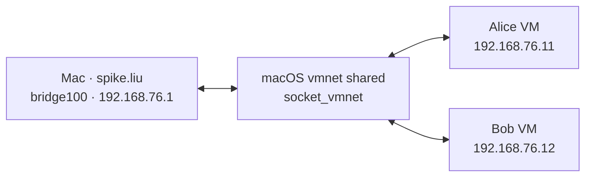

# Mac 与 VM 的真实 Workspace 交互验收

原始验收证据仅保留在本地 `vm-evidence/2026-10-09/`，不纳入版本管理。下文证据文件名均相对此目录。

2026-10-09，Asia/Shanghai。本轮把 Mac 本机 `spike.liu` 接入 Alice、Bob 的虚拟局域网，
恢复用户已经发送的 Bob 好友申请，完成聊天授权、双向聊天和访问审批。使用现有二进制，
没有重新编译，也没有执行 `cargo test`。

## 结果

原申请 `id=7` 从 `queued` 变为 `pending`，经 Bob 在审批中心点击「允许」后变为
`active`，`error_message=null`。没有创建重复好友申请。

原网络只连接两台 VM，Mac 不在其中；HTTP 浏览器入口的 TCP 转发也不能提供原生 DHTTP
所需的 mDNS 和 UDP/QUIC。切换共享网络后，原申请由实际 worker 自动送达。
这是本机与 VM 的局域网问题得到解决，尚不能据此判断同事的公网连接或强制 OCSP 问题。

| 实测场景 | 实际结果 | 证据 |
| --- | --- | --- |
| Alice、Bob 原生客户端读取本机公开资料 | 两者均返回 HTTP/3 200，TLS 对端为 `spike.liu.dhttp.net` | 网络与运行记录（`host-vm-runtime-and-network.json`） |
| 原有好友申请投递 | Mac 的 `id=7` 对应 Bob 的 `POST /contact`，HTTP/3 201 | 已验证 QUIC 路径（`host-vm-verified-business-quic-paths.log`） |
| Bob 在真实页面批准聊天 | 能力申请 `request_id=31`，页面操作返回 204 | 审批响应（`host-vm-bob-grant.json`） |
| 双方确认授权 | 两端 `can_send=true`、`can_receive=true`、`remote_grant=true` | 好友最终状态（`host-vm-friendship-final.json`） |
| 本机发送、Bob 收到 | 本机消息 `45/sent`，Bob 消息 `129/received`，相同 `client_message_id` | 双向聊天（`host-vm-bidirectional-chat.json`） |
| Bob 回复、本机收到 | Bob 消息 `130/sent`，本机消息 `46/received`，相同 `client_message_id` | 同上；双方页面自动更新，每条只收到一份 |
| 本机请求 Bob 业务接口，Bob 允许 | 初次 202，审批状态 `pending → allowed`，重试 200，实际到达 `pishoo-bob` 上游 | 访问审批（`host-vm-access-acceptance.json`） |
| 本机请求 Bob 业务接口，Bob 拒绝 | 初次 202，审批状态 `pending → denied`，重试 403 | 同上 |
| Alice ↔ Bob 原有交互环境 | Alice 读取 Bob 资料返回 HTTP/3 200，双方聊天能力和授权仍有效 | 最终能力检查（`host-vm-final-capabilities.json`） |

访问审批测试用 Bob 的精确 `GET /vm-review/host-*` 规则，仅针对 `spike.liu.dhttp.net`。
允许和拒绝均在 Bob 的 Workspace 页面操作，并确认对话框。业务代理会去掉 `/vm-review`
前缀，再把请求交给 VM 内的 `127.0.0.1:8090` 上游。测试后已删除临时规则，确认 Bob
原有规则恢复、审批待办为零。没有给本机日常服务增加泛开放规则。

聊天证据不仅是本地发送接口的 202：两端消息状态、接收消息 ID、正文和页面显示均已核对，
Bob 服务日志也确认 `spike.liu` 的 `POST /std/message` 经真实 HTTP/3 返回 200。

页面截图：Bob 收到原申请（`host-vm-bob-pending.png`）、
本机聊天（`host-vm-host-chat.png`）、
Bob 聊天（`host-vm-bob-chat.png`）、
访问允许待审批（`host-vm-bob-access-allow-pending.png`）、
访问拒绝待审批（`host-vm-bob-access-deny-pending.png`）。

## 当前网络与浏览器入口



两台 VM 保留原来的 QEMU user networking 出站网卡及 SSH/浏览器 TCP 转发，第二块 LAN
网卡改由 `socket_vmnet_client` 传入文件描述符，QEMU 使用 `-netdev socket,id=lan,fd=3`。
`listen=1` 的 VM 继续使用局域网发现，无需新增 Bob 公网 DDNS 记录或假定固定 UDP 443。
日志确认好友投递实际使用 `192.168.76.1:61393 → 192.168.76.12:50007`；后续聊天也验证
了该 IPv4 路径和共享网段的 IPv6 路径。端口及 IPv6 前缀可能在下次启动变化。

| 身份 | 本轮 Workspace 入口 | 身份认证来源 |
| --- | --- | --- |
| 本机 `spike.liu` | `https://spike.liu~/workspace/contacts/bob.forlocaltest.dhttp.net/chat`，CDP 19183 | 本机 AnySee 原生 DHTTP，使用日常 `~/.dhttp` 身份 |
| Alice | `http://127.0.0.1:18081/workspace/`，CDP 19181 | VM 内的真实 DHTTP 浏览器桥，使用 Alice 证书 |
| Bob | `http://127.0.0.1:18082/workspace/contacts/spike.liu.dhttp.net/chat`，CDP 19182 | VM 内的真实 DHTTP 浏览器桥，使用 Bob 证书 |

本机使用现有源码目录里的浏览器程序：
`/Volumes/Genmeta/spike/chromium/src/out/thorium/AnySee.app/Contents/MacOS/AnySee`，
独立浏览器数据目录为下述运行目录中的 `host-browser-source/`。
安装版 `/Applications/AnySee.app` 本轮加载 Workspace 的 JS/CSS 时出现
`ERR_QUIC_PROTOCOL_ERROR`；源码目录的现有浏览器成功完成页面操作。
它第一次直接导航 Bob 的公开资料也曾返回 `ERR_NAME_NOT_RESOLVED`，后续导航成功。
因此本报告证明实际交互已通过，未宣称浏览器所有首次连接问题均已修复。
按用户要求，本轮没有展开处理原有 HTTP/3 异常。

## 保留的启动配置

运行目录在仓库外：

```text
/Users/x/Library/Caches/pishoo-vm-acceptance/20261008/
  alice/launch.json                  # 已更新为共享网络启动参数
  bob/launch.json                    # 已更新为共享网络启动参数
  host-vm-network/
    start-network-root.sh
    start-network.applescript
    stop-network-root.sh
    alice-launch-shared.sh
    bob-launch-shared.sh
    alice-launch-original.json       # 原 VM socket 网络，供回滚
    bob-launch-original.json
    alice-launch-shared.json
    bob-launch-shared.json
    host-pishoo.pid
    host-pishoo.log
    host-browser.pid
    host-browser-source/
    before-network/spike.liu/        # 日常数据库备份，仅本机保存
```

网络辅助程序为 Homebrew 预编译 `socket_vmnet 1.2.2`，下载、校验并解包，没有从源码编译。
实际执行文件为 root 所有的 `/opt/pishoo-vm-network/socket_vmnet`，SHA256 为
`d8dc56d05f9e50640ec6e57dc6ee895310eeccb79c326c19aac840331daa356a`。
它由临时系统任务 `net.genmeta.pishoo-vm-test` 管理，socket 为
`/private/var/run/pishoo-vm-test.sock`，日志为 `/private/var/log/pishoo-vm-test.log`。
该任务没有配置为开机持久服务。

**当前环境已运行，不需要再启动。** macOS 重启后，若 socket 不存在，先运行网络启动脚本；
脚本会通过系统管理员认证创建共享网络。仅在对应 VM 已关机时运行 VM 启动命令：

```sh
osascript /Users/x/Library/Caches/pishoo-vm-acceptance/20261008/host-vm-network/start-network.applescript
sh /Users/x/Library/Caches/pishoo-vm-acceptance/20261008/host-vm-network/alice-launch-shared.sh
sh /Users/x/Library/Caches/pishoo-vm-acceptance/20261008/host-vm-network/bob-launch-shared.sh
```

本机 Pishoo 应在共享接口出现后运行。本轮核实旧进程已不存在，使用已有
`target/debug/pishoo -c /Users/x/.dhttp/pishoo.conf` 恢复服务；随后确认它绑定
`192.168.76.1` 及共享 IPv6 地址。已有进程时先检查真实 PID 和 UDP 绑定，避免重复启动；
不要根据过期的 `pishoo.pid` 判断进程。

运行二进制摘要、VM 三个服务的 active 状态和网络地址记录在
运行记录（`host-vm-runtime-and-network.json`）。源码基线仍为
`feat/rebase-daccess` / `c57c08d1e00272e5d0a8ccd73c7460e65c84a12a`，另有此前实测修复的
未提交工作区改动；本轮仅新增验收文档与证据，没有改产品代码、关闭 OCSP 或更改暂存区。

## 回滚网络

回滚只恢复原来 Alice ↔ Bob 的 VM 网络，会使 Mac 再次离开测试 LAN：

1. 分别通过现有 SSH 入口执行 `sudo systemctl poweroff`，等待两台 QEMU 退出。
2. 执行 `sudo sh /Users/x/Library/Caches/pishoo-vm-acceptance/20261008/host-vm-network/stop-network-root.sh`，移除临时系统网络任务。
3. 把 `host-vm-network/alice-launch-original.json`、`bob-launch-original.json` 分别复制回 `alice/launch.json`、`bob/launch.json`。
4. 用原 JSON 参数启动 Alice，再启动 Bob。原参数 JSON 是完整 argv 数组，可用 Python 的 `subprocess.run(json.load(...), check=True)` 执行。

网络回滚不需要恢复数据库。实际申请、授权及测试消息保留在相应身份中。
本机四库备份位于 `host-vm-network/before-network/spike.liu/`；VM 四库备份分别位于
`/opt/pishoo/backups/before-host-network-alice/` 和 `before-host-network-bob/`。
整库恢复会覆盖之后的操作，应与网络回滚分开处理。私钥、数据库、VM 磁盘和辅助程序二进制
均未复制到仓库。

公网 NAT 路径、同事跨网申请失败的具体原因、强制 OCSP 和原有 HTTP/3 异常仍待后续排查。
