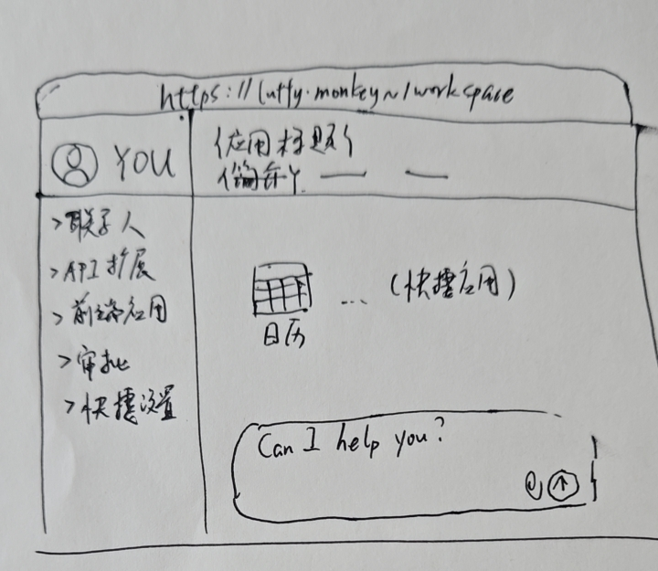
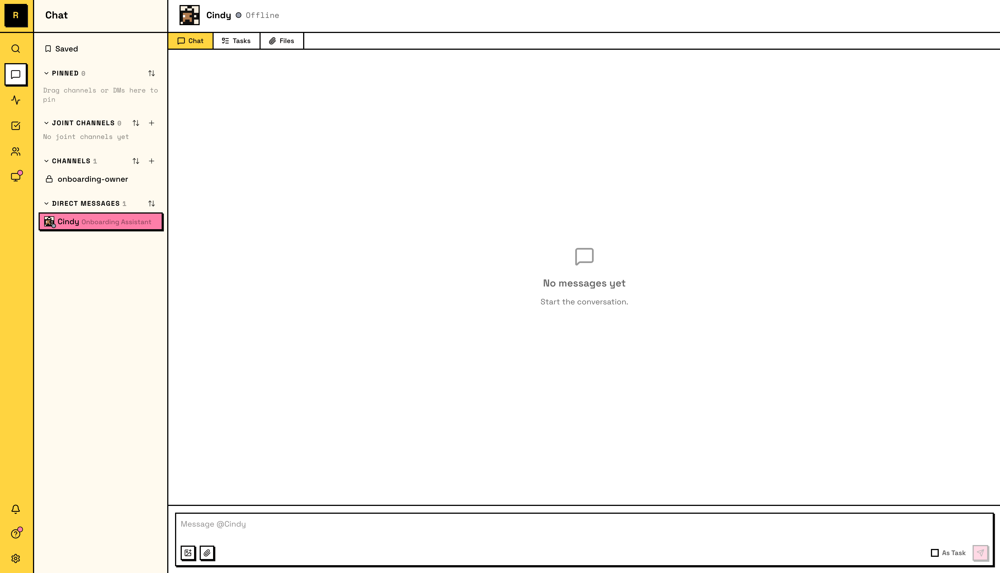

# /workspace 畅想

前端界面的导航：

- 联系人（社交还是太重要，所以联系人单独拿出来放最上面）

    - 添加联系人

    - 新联系人申请

    - 联系人列表

        - san\.zhang（点击，进入聊天，如果没有对方的消息权限，标题提示无权限）

        - walle\.robot

            - 以下是详情介绍：

                - 头像

                - 类型：Human、Agent、Robot、Service、Admin

                - 开放的功能列表

                - 添加时间，上次更新时间

                - 权限列表，按联系人维度，管理访问控制

- API 扩展（每个功能扩展，都是一套 API 集合、一个数据库）

    - 消息模块

        - 简介（卸载、禁用）

        - API 集合

        - 访问控制

    - 日历模块

        - 简介（卸载、禁用）

        - API 集合

        - 访问控制

    - 智能体模块

    - 项目管理模块

    - 每个模块一个 wasm

    - 探索更多模块（模块市场，下载，安装）

- 应用管理（自带界面串联起 API 逻辑，界面访问并不对外开放）

    - 日历

    - 日记

    - 项目管理

    - 探索更多应用（应用市场，下载安装）

- 审批请求

    - 每个待审批的请求，记得提供个 Checkbox，“是否记住当前的选择”，便于以后都允许/拒绝 来访者的该 API 请求

- 快捷设置

    - 设置我的信息，我的头像、昵称、性别等信息

    - 自定义权限集合，方便添加联系人时使用（比如，社交权限：GET /std/profile/avatar /std/profile/nickname, POST /std/message 这 3 条权限的组合）

    - 快捷导航（放置在首次空白页的右下空间，比如日历、ChatBot 等整合型应用快捷入口）

